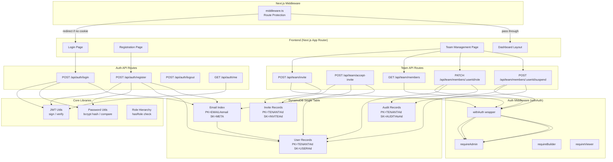

# Design Document: Authentication, RBAC & Tenant Management

## Overview

This design implements a custom JWT-based authentication system, role-based access control (RBAC) with a three-tier hierarchy, and multi-tenant team management for CourseForge Connect. The system uses the existing DynamoDB single-table design, extending it with User, Email Index, and Invite record types. Authentication is handled via HS256 JWTs stored in HttpOnly cookies, with a reusable `withAuth` middleware that enforces role hierarchy across all protected API routes.

Key design decisions:
- **No third-party auth libraries**: Direct JWT handling via `jose` keeps the auth layer transparent and avoids vendor lock-in.
- **Single-table DynamoDB**: User, Email Index, and Invite records share the existing table, following the established `PK/SK` pattern from `src/models/schema.ts`.
- **Role hierarchy as a numeric level**: `admin > builder > viewer` is modeled as a simple numeric comparison, making authorization checks O(1).
- **HttpOnly cookies**: JWTs are never exposed to client-side JavaScript, mitigating XSS token theft.

## Architecture



## Components and Interfaces

### 1. JWT Utilities (`app/lib/auth/jwt.ts`)

```typescript
interface JWTPayload {
  userId: string;
  tenantId: string;
  role: 'admin' | 'builder' | 'viewer';
  email: string;
}

function signToken(payload: JWTPayload): Promise<string>;
function verifyToken(token: string): Promise<JWTPayload>;
function setSessionCookie(response: NextResponse, token: string): void;
function clearSessionCookie(response: NextResponse): void;
```

- Uses `jose` library with HS256 algorithm
- Secret from `AUTH_JWT_SECRET` env var
- 1-hour expiry on all tokens
- Cookie: `courseforge_session`, HttpOnly, SameSite=Strict, Secure, Path=/

### 2. Password Utilities (`app/lib/auth/password.ts`)

```typescript
function hashPassword(password: string): Promise<string>;
function verifyPassword(password: string, hash: string): Promise<boolean>;
```

- bcrypt with 12 salt rounds
- Constant-time comparison via `bcrypt.compare`

### 3. Role Hierarchy (`app/lib/auth/roles.ts`)

```typescript
type UserRole = 'admin' | 'builder' | 'viewer';

const ROLE_LEVEL: Record<UserRole, number> = {
  admin: 3,
  builder: 2,
  viewer: 1,
};

function hasRole(userRole: UserRole, requiredRole: UserRole): boolean;
```

- `hasRole` returns `ROLE_LEVEL[userRole] >= ROLE_LEVEL[requiredRole]`
- Pure function, no side effects, easily testable

### 4. Auth Middleware (`app/lib/auth/middleware.ts`)

```typescript
interface AuthContext {
  userId: string;
  tenantId: string;
  role: UserRole;
  email: string;
}

type AuthenticatedHandler = (
  req: NextRequest,
  ctx: AuthContext,
) => Promise<NextResponse>;

function withAuth(
  handler: AuthenticatedHandler,
  options?: { requiredRole?: UserRole },
): (req: NextRequest) => Promise<NextResponse>;

// Convenience wrappers
const requireAdmin = (handler: AuthenticatedHandler) =>
  withAuth(handler, { requiredRole: 'admin' });
const requireBuilder = (handler: AuthenticatedHandler) =>
  withAuth(handler, { requiredRole: 'builder' });
const requireViewer = (handler: AuthenticatedHandler) =>
  withAuth(handler, { requiredRole: 'viewer' });
```

- Extracts JWT from `courseforge_session` cookie
- Verifies signature and expiry via `verifyToken`
- Checks role hierarchy if `requiredRole` is specified
- Returns 401 for missing/invalid/expired tokens
- Returns 403 with `{ error: 'Insufficient permissions', requiredRole }` for role failures
- Attaches `AuthContext` to handler on success

### 5. Auth API Routes

| Route | Method | Auth | Description |
|---|---|---|---|
| `/api/auth/register` | POST | None | Register user + create tenant |
| `/api/auth/login` | POST | None | Authenticate and issue session |
| `/api/auth/logout` | POST | None | Clear session cookie |
| `/api/auth/me` | GET | Required | Return current user from JWT |

### 6. Team Management API Routes

| Route | Method | Auth | Description |
|---|---|---|---|
| `/api/team/invite` | POST | Admin | Create team invitation |
| `/api/team/accept-invite` | POST | None | Accept invite and register |
| `/api/team/members` | GET | Admin | List tenant members |
| `/api/team/members/[userId]/role` | PATCH | Admin | Change member role |
| `/api/team/members/[userId]/suspend` | POST | Admin | Suspend member |

### 7. Next.js Route Protection Middleware (`middleware.ts`)

```typescript
// Root-level middleware.ts
export function middleware(request: NextRequest): NextResponse;
export const config = {
  matcher: ['/(dashboard)/:path*'],
};
```

- Checks for `courseforge_session` cookie presence and JWT validity
- Redirects to `/login` if missing or invalid
- Passes through for valid sessions

### 8. Frontend Pages

| Page | Path | Access |
|---|---|---|
| Login | `/login` | Public |
| Register | `/register` | Public |
| Accept Invite | `/accept-invite` | Public (with token param) |
| Team Management | `/(dashboard)/admin/team` | Admin only |


## Data Models

All records share the existing DynamoDB single table (`RecipeLibrary`) using the established `PK/SK` pattern from `src/models/schema.ts`.

### New Key Builders (added to `src/models/schema.ts`)

```typescript
// Existing: tenantPK(tenantId) → "TENANT#{tenantId}"
// Existing: KEY_PREFIX.USER → "USER#"

export function userSK(userId: string): string {
  return `${KEY_PREFIX.USER}${userId}`;
}

// New prefixes
export const KEY_PREFIX_AUTH = {
  EMAIL: 'EMAIL#',
  INVITE: 'INVITE#',
} as const;

export function emailPK(email: string): string {
  return `${KEY_PREFIX_AUTH.EMAIL}${email}`;
}

export function inviteSK(inviteId: string): string {
  return `${KEY_PREFIX_AUTH.INVITE}${inviteId}`;
}
```

### User Record

| Field | Type | Description |
|---|---|---|
| PK | `TENANT#{tenantId}` | Partition key |
| SK | `USER#{userId}` | Sort key |
| userId | string (UUID) | Unique user identifier |
| tenantId | string (UUID) | Owning tenant |
| email | string | User email |
| passwordHash | string | bcrypt hash |
| role | `'admin' \| 'builder' \| 'viewer'` | User role |
| status | `'active' \| 'invited' \| 'suspended'` | Account status |
| createdAt | string (ISO 8601) | Creation timestamp |
| lastLoginAt | string (ISO 8601) | Last login timestamp |
| notificationPrefs | `{ globalEnabled: boolean, workflowIds: string[] \| 'all' }` | Notification settings |

### Email Index Record

| Field | Type | Description |
|---|---|---|
| PK | `EMAIL#{email}` | Partition key (enables email lookup without scan) |
| SK | `META` | Sort key |
| userId | string (UUID) | Referenced user |
| tenantId | string (UUID) | Referenced tenant |

### Invite Record

| Field | Type | Description |
|---|---|---|
| PK | `TENANT#{tenantId}` | Partition key |
| SK | `INVITE#{inviteId}` | Sort key |
| inviteId | string (UUID) | Unique invite identifier |
| email | string | Invited email address |
| role | `'admin' \| 'builder' \| 'viewer'` | Assigned role |
| invitedBy | string (UUID) | Admin userId who created invite |
| createdAt | string (ISO 8601) | Creation timestamp |
| expiresAt | string (ISO 8601) | Expiry (48 hours from creation) |
| accepted | boolean | Whether invite has been used |

### Access Patterns

| Pattern | Key Condition |
|---|---|
| Get user by tenant + userId | `PK = TENANT#{tenantId}, SK = USER#{userId}` |
| List users in tenant | `PK = TENANT#{tenantId}, SK begins_with USER#` |
| Lookup user by email | `PK = EMAIL#{email}, SK = META` |
| Get invite | `PK = TENANT#{tenantId}, SK = INVITE#{inviteId}` |
| List invites for tenant | `PK = TENANT#{tenantId}, SK begins_with INVITE#` |

### TypeScript Interfaces

```typescript
// app/lib/auth/types.ts

export type UserRole = 'admin' | 'builder' | 'viewer';
export type UserStatus = 'active' | 'invited' | 'suspended';

export interface UserRecord {
  PK: string;
  SK: string;
  userId: string;
  tenantId: string;
  email: string;
  passwordHash: string;
  role: UserRole;
  status: UserStatus;
  createdAt: string;
  lastLoginAt?: string;
  notificationPrefs: {
    globalEnabled: boolean;
    workflowIds: string[] | 'all';
  };
}

export interface EmailIndexRecord {
  PK: string;
  SK: string;
  userId: string;
  tenantId: string;
}

export interface InviteRecord {
  PK: string;
  SK: string;
  inviteId: string;
  email: string;
  role: UserRole;
  invitedBy: string;
  createdAt: string;
  expiresAt: string;
  accepted: boolean;
}

export interface AuthContext {
  userId: string;
  tenantId: string;
  role: UserRole;
  email: string;
}

export interface JWTPayload {
  userId: string;
  tenantId: string;
  role: UserRole;
  email: string;
}
```


## Correctness Properties

*A property is a characteristic or behavior that should hold true across all valid executions of a system — essentially, a formal statement about what the system should do. Properties serve as the bridge between human-readable specifications and machine-verifiable correctness guarantees.*

### Property 1: JWT sign/verify round-trip

*For any* valid JWT payload containing a userId (non-empty string), tenantId (non-empty string), role (one of 'admin', 'builder', 'viewer'), and email (non-empty string), signing the payload with a secret and then verifying the resulting token with the same secret SHALL produce a payload equivalent to the original input.

**Validates: Requirements 16.3**

### Property 2: Role hierarchy is a total order

*For any* pair of roles (userRole, requiredRole) drawn from {'admin', 'builder', 'viewer'}, the `hasRole(userRole, requiredRole)` function SHALL return true if and only if `ROLE_LEVEL[userRole] >= ROLE_LEVEL[requiredRole]`. Specifically: admin satisfies all roles, builder satisfies builder and viewer, viewer satisfies only viewer.

**Validates: Requirements 6.2, 6.3, 6.4, 5.4**

### Property 3: Registration input validation

*For any* string, the registration validation SHALL reject the string as an email if it does not match a standard email format, and SHALL reject the string as a password if its length is less than 12 characters. Valid emails and passwords of length >= 12 SHALL be accepted.

**Validates: Requirements 1.1, 1.2**

### Property 4: Registration creates correct DynamoDB records

*For any* valid registration input (valid email, password >= 12 chars, non-empty tenantName), the registration handler SHALL write exactly three records to DynamoDB: a User record with `PK=TENANT#{tenantId}` and `SK=USER#{userId}` with role='admin' and status='active', an Email Index record with `PK=EMAIL#{email}` and `SK=META` containing the userId and tenantId, and a Tenant record. All generated UUIDs SHALL be valid v4 UUIDs.

**Validates: Requirements 1.6, 17.1, 17.2**

### Property 5: Login failure responses are indistinguishable

*For any* login failure scenario — whether the email does not exist, the user status is not 'active', or the password does not match — the login handler SHALL return an identical 401 response with the body `{ error: 'Invalid credentials' }` and no additional information that distinguishes the failure reason.

**Validates: Requirements 2.4, 11.6**

### Property 6: Auth middleware correctness

*For any* request, if the `courseforge_session` cookie contains a valid, non-expired JWT signed with the correct secret, the `withAuth` middleware SHALL call the handler with an AuthContext whose userId, tenantId, role, and email match the JWT payload. If the cookie is missing, or the token is malformed, expired, or signed with a different secret, the middleware SHALL return a 401 response without calling the handler.

**Validates: Requirements 5.1, 5.2, 5.3, 5.6**

### Property 7: Invite record creation

*For any* valid invite input (non-empty email, role in {'admin', 'builder', 'viewer'}), the invite handler SHALL create an Invite record with `PK=TENANT#{tenantId}` and `SK=INVITE#{inviteId}` where inviteId is a valid UUID, expiresAt is approximately 48 hours after createdAt, accepted is false, and invitedBy matches the admin's userId.

**Validates: Requirements 7.1, 7.5, 17.3**

### Property 8: Accept-invite assigns the invite's role

*For any* valid, non-expired, non-accepted invite with a role R, accepting the invite SHALL create a User record with role equal to R and status equal to 'active'.

**Validates: Requirements 8.5**

## Error Handling

### HTTP Status Codes

| Scenario | Status | Body |
|---|---|---|
| Validation failure (email format, password length) | 400 | `{ error: string, field?: string }` |
| Missing/invalid/expired JWT | 401 | `{ error: 'Unauthorized' }` |
| Wrong credentials (any reason) | 401 | `{ error: 'Invalid credentials' }` |
| Insufficient role | 403 | `{ error: 'Insufficient permissions', requiredRole: string }` |
| Invite not found | 404 | `{ error: 'Invite not found' }` |
| Email already registered | 409 | `{ error: 'Email already registered' }` |
| Invite already accepted | 409 | `{ error: 'Invite already used' }` |
| Invite expired | 410 | `{ error: 'Invite expired' }` |
| Self-demotion / self-suspension | 422 | `{ error: string }` |
| Server error | 500 | `{ error: 'Internal server error' }` |

### Error Handling Strategy

- All API routes use try/catch at the top level, returning 500 for unexpected errors
- Validation errors are returned early before any DynamoDB operations
- Login failures intentionally return the same 401 response regardless of failure reason (security: prevents user enumeration)
- DynamoDB conditional check failures (e.g., duplicate email race condition) are caught and mapped to appropriate 409 responses
- JWT verification errors (expired, malformed, wrong signature) all map to 401

## Testing Strategy

### Property-Based Tests (fast-check, minimum 100 iterations each)

The project already uses `fast-check` with `vitest` (see `package.json` and existing `*.property.test.ts` files). Each property test file follows the naming convention `{module}.property.test.ts`.

| Property | Test File | What It Validates |
|---|---|---|
| P1: JWT round-trip | `app/lib/auth/jwt.property.test.ts` | sign → verify preserves payload |
| P2: Role hierarchy | `app/lib/auth/roles.property.test.ts` | hasRole matches ROLE_LEVEL comparison |
| P3: Registration validation | `app/lib/auth/validation.property.test.ts` | email/password accept/reject |
| P4: Registration records | `app/api/auth/register.property.test.ts` | correct DynamoDB records created |
| P5: Login failure indistinguishability | `app/api/auth/login.property.test.ts` | identical 401 for all failure modes |
| P6: Middleware correctness | `app/lib/auth/middleware.property.test.ts` | valid → context, invalid → 401 |
| P7: Invite record creation | `app/api/team/invite.property.test.ts` | correct invite record structure |
| P8: Accept-invite role | `app/api/team/accept-invite.property.test.ts` | user gets invite's role |

Each test is tagged: `Feature: auth-rbac-tenant, Property {N}: {title}`

### Unit Tests (vitest, example-based)

| Area | Test File | Key Scenarios |
|---|---|---|
| Registration | `app/api/auth/register.test.ts` | Happy path, duplicate email 409, bcrypt 12 rounds, bootstrap called |
| Login | `app/api/auth/login.test.ts` | Happy path, suspended user, wrong password, lastLoginAt update |
| Logout | `app/api/auth/logout.test.ts` | Cookie cleared, 204 response |
| Session (/me) | `app/api/auth/me.test.ts` | Valid JWT returns user, missing cookie 401 |
| Middleware | `app/lib/auth/middleware.test.ts` | Valid token, expired token, missing cookie, role checks, convenience wrappers |
| Team invite | `app/api/team/invite.test.ts` | Happy path, non-admin 403, response URL format |
| Accept invite | `app/api/team/accept-invite.test.ts` | Happy path, 404/409/410 error cases, email index created |
| List members | `app/api/team/members.test.ts` | Happy path, non-admin 403, response shape |
| Change role | `app/api/team/members/[userId]/role.test.ts` | Happy path, self-demotion 422, audit log |
| Suspend | `app/api/team/members/[userId]/suspend.test.ts` | Happy path, self-suspension 422, audit log, 204 |

### Integration Tests

- Registration → Login → /me flow (end-to-end with mocked DynamoDB)
- Invite → Accept → Login flow
- Suspend → Login rejected flow
- Dashboard middleware redirect flow

### Test Configuration

- Library: `vitest` + `fast-check` (already in devDependencies)
- Property tests: `{ numRuns: 100 }` minimum
- Mocking: DynamoDB client mocked for all unit and property tests
- JWT secret: test-only secret for deterministic tests
