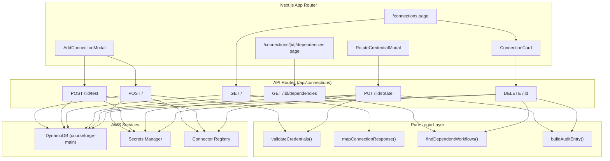

# Design Document: Connection Management

## Overview

Connection Management provides the credential lifecycle for CourseForge Connect, enabling tenants to create, test, rotate, and delete integration credentials for external systems. The feature bridges the existing DynamoDB single-table (`courseforge-main`) with AWS Secrets Manager to keep credential metadata queryable while storing sensitive values in a dedicated secrets service.

The design follows the existing codebase patterns: pure logic functions separated from I/O handlers, repository interfaces abstracting DynamoDB, and property-based testing with `fast-check`. New DynamoDB items use the established PK/SK single-table pattern with `TENANT#` prefix, and a new `CONNECTION#` sort-key prefix is introduced alongside the existing `WORKFLOW#` prefix.

### Key Design Decisions

1. **Secrets Manager for credentials, DynamoDB for metadata** — Credentials never touch DynamoDB. The Connection record stores only a `secretRef` (ARN) pointing to the Secrets Manager secret. This keeps the blast radius small if the table is ever exposed.
2. **Soft-delete with recovery window** — Deleting a connection sets `status: 'deleted'` in DynamoDB and schedules Secrets Manager deletion with a 7-day recovery window, allowing undo.
3. **Test-before-save on create and rotate** — The connector registry's `testFn` is invoked before persisting new or rotated credentials, preventing broken connections from entering the system.
4. **Audit log as DynamoDB items** — Audit entries share the tenant partition (`TENANT#{tenantId}`) with an `AUDIT#` sort key, keeping them co-located for tenant-scoped queries without a separate table.

## Architecture



### Layer Responsibilities

- **Frontend**: React components and pages under the Next.js App Router. No direct AWS SDK calls.
- **API Routes**: Thin handlers that parse requests, call logic functions, orchestrate repository/secrets calls, and return responses. Follow the existing `createXxxHandler(repo)` factory pattern.
- **Pure Logic Layer**: Stateless functions for validation, response mapping, dependency detection, and audit entry construction. Fully unit- and property-testable.
- **Connector Registry**: A static module exporting `ConnectorDefinition` objects. Each definition includes a JSON Schema 7 `credentialSchema` and a `testFn`.

## Components and Interfaces

### ConnectorDefinition

```typescript
interface ConnectorDefinition {
  key: string;                          // e.g. 'canvas-lms'
  displayName: string;                  // e.g. 'Canvas LMS'
  authType: 'oauth2' | 'apikey' | 'basic';
  credentialSchema: Record<string, unknown>; // JSON Schema 7
  testFn: (credentials: Record<string, unknown>, baseUrl?: string) => Promise<TestResult>;
}

interface TestResult {
  success: boolean;
  message: string;
}
```

### ConnectionRepository

```typescript
interface ConnectionRepository {
  create(connection: ConnectionRecord): Promise<void>;
  getById(tenantId: string, connectionId: string): Promise<ConnectionRecord | null>;
  listByTenant(tenantId: string): Promise<ConnectionRecord[]>;
  update(tenantId: string, connectionId: string, fields: Partial<ConnectionRecord>): Promise<void>;
  softDelete(tenantId: string, connectionId: string, deletedAt: string): Promise<void>;
}
```

### SecretsService

```typescript
interface SecretsService {
  createSecret(secretName: string, value: Record<string, unknown>): Promise<string>; // returns ARN
  getSecretValue(secretRef: string): Promise<Record<string, unknown>>;
  putSecretValue(secretRef: string, value: Record<string, unknown>): Promise<void>;
  scheduleDelete(secretRef: string, recoveryWindowDays: number): Promise<void>;
}
```

### AuditRepository

```typescript
interface AuditRepository {
  writeEntry(entry: AuditLogEntry): Promise<void>;
}
```

### Pure Logic Functions

```typescript
// Validates credentials against the connector's JSON Schema
function validateCredentials(
  connectorKey: string,
  credentials: Record<string, unknown>,
  registry: Map<string, ConnectorDefinition>,
): { valid: true } | { valid: false; errors: Array<{ field: string; message: string }> };

// Maps a ConnectionRecord to a safe API response (no secretRef, no credentials)
function mapConnectionToListItem(connection: ConnectionRecord): ConnectionListItem;

// Finds workflows that reference a given connectionId
function filterDependentWorkflows(
  workflows: WorkflowRecord[],
  connectionId: string,
): DependentWorkflow[];

// Checks if any dependent workflow has status 'active' (published)
function hasPublishedDependents(dependents: DependentWorkflow[]): boolean;

// Builds an audit log entry
function buildAuditEntry(
  tenantId: string,
  actionType: 'CONNECTION_ROTATED' | 'CONNECTION_DELETED',
  actor: string,
  resourceId: string,
  ip: string,
): AuditLogEntry;
```

### API Route Handlers

| Route | Method | Handler Factory | Description |
|-------|--------|----------------|-------------|
| `/api/connections` | POST | `createConnectionHandler(repo, secrets, registry)` | Create connection |
| `/api/connections/:id/test` | POST | `testConnectionHandler(repo, secrets, registry)` | Test connection |
| `/api/connections` | GET | `listConnectionsHandler(repo)` | List tenant connections |
| `/api/connections/:id/dependencies` | GET | `getDependenciesHandler(repo, workflowRepo)` | Get dependent workflows |
| `/api/connections/:id/rotate` | PUT | `rotateConnectionHandler(repo, secrets, registry, audit)` | Rotate credentials |
| `/api/connections/:id` | DELETE | `deleteConnectionHandler(repo, secrets, workflowRepo, audit)` | Delete connection |


## Data Models

### Connection Record (DynamoDB)

| Attribute | Type | Description |
|-----------|------|-------------|
| PK | `TENANT#{tenantId}` | Partition key |
| SK | `CONNECTION#{connectionId}` | Sort key |
| connectionId | string (UUID) | Unique connection identifier |
| tenantId | string | Owning tenant |
| connectorKey | string | Registry key (e.g. `canvas-lms`) |
| displayName | string | User-facing label |
| authType | `'oauth2' \| 'apikey' \| 'basic'` | Authentication method |
| secretRef | string | Secrets Manager ARN |
| scopes | string[] | OAuth scopes (empty for non-OAuth) |
| status | `'active' \| 'error' \| 'pending' \| 'deleted'` | Lifecycle state |
| createdAt | string (ISO 8601) | Creation timestamp |
| updatedAt | string (ISO 8601) | Last modification timestamp |
| lastTestedAt | string (ISO 8601) \| null | Last successful test timestamp |
| createdBy | string | Actor who created the connection |
| deletedAt | string (ISO 8601) \| null | Soft-delete timestamp |

```typescript
interface ConnectionRecord {
  connectionId: string;
  tenantId: string;
  connectorKey: string;
  displayName: string;
  authType: 'oauth2' | 'apikey' | 'basic';
  secretRef: string;
  scopes: string[];
  status: 'active' | 'error' | 'pending' | 'deleted';
  createdAt: string;
  updatedAt: string;
  lastTestedAt: string | null;
  createdBy: string;
  deletedAt: string | null;
}
```

### Connection List Item (API Response)

```typescript
interface ConnectionListItem {
  connectionId: string;
  displayName: string;
  connectorKey: string;
  authType: 'oauth2' | 'apikey' | 'basic';
  status: 'active' | 'error' | 'pending' | 'deleted';
  createdAt: string;
  lastTestedAt: string | null;
}
```

### Secret Value (Secrets Manager)

Secret name: `courseforge/tenant/{tenantId}/connection/{connectionId}`

```typescript
interface SecretValue {
  accessToken?: string;
  refreshToken?: string;
  apiKey?: string;
  username?: string;
  password?: string;
  expiresAt?: string;
  baseUrl?: string;
}
```

### Audit Log Entry (DynamoDB)

| Attribute | Type | Description |
|-----------|------|-------------|
| PK | `TENANT#{tenantId}` | Partition key |
| SK | `AUDIT#{timestamp}#{uuid}` | Sort key (lexicographic ordering) |
| actionType | string | `CONNECTION_ROTATED` or `CONNECTION_DELETED` |
| actor | string | User who performed the action |
| resourceId | string | The connectionId acted upon |
| ip | string | Client IP address |
| timestamp | string (ISO 8601) | When the action occurred |

```typescript
interface AuditLogEntry {
  tenantId: string;
  actionType: 'CONNECTION_ROTATED' | 'CONNECTION_DELETED';
  actor: string;
  resourceId: string;
  ip: string;
  timestamp: string;
}
```

### Dependent Workflow (API Response)

```typescript
interface DependentWorkflow {
  workflowId: string;
  name: string;
  status: string;
}
```

### DynamoDB Key Builders

```typescript
const CONNECTION_PREFIX = 'CONNECTION#';
const AUDIT_PREFIX = 'AUDIT#';

function connectionPK(tenantId: string): string {
  return `TENANT#${tenantId}`;
}

function connectionSK(connectionId: string): string {
  return `${CONNECTION_PREFIX}${connectionId}`;
}

function auditSK(timestamp: string, uuid: string): string {
  return `${AUDIT_PREFIX}${timestamp}#${uuid}`;
}
```

### DynamoDB Access Patterns

| Access Pattern | Key Condition | Index |
|---------------|---------------|-------|
| List connections by tenant | PK = `TENANT#{tenantId}`, SK begins_with `CONNECTION#` | Main table |
| Get connection by ID | PK = `TENANT#{tenantId}`, SK = `CONNECTION#{connectionId}` | Main table |
| List workflows by tenant | PK = `TENANT#{tenantId}`, SK begins_with `WORKFLOW#` | Main table |
| List audit entries by tenant | PK = `TENANT#{tenantId}`, SK begins_with `AUDIT#` | Main table |


## Correctness Properties

*A property is a characteristic or behavior that should hold true across all valid executions of a system — essentially, a formal statement about what the system should do. Properties serve as the bridge between human-readable specifications and machine-verifiable correctness guarantees.*

### Property 1: Credential validation correctness

*For any* connector key in the registry and *for any* credentials object, `validateCredentials` returns `{ valid: true }` if and only if the credentials conform to the connector's `credentialSchema`, and returns `{ valid: false, errors }` with non-empty structured errors (each containing `field` and `message`) otherwise.

**Validates: Requirements 1.1, 1.5**

### Property 2: Secret naming convention

*For any* tenantId and connectionId (non-empty strings), the constructed secret name equals `courseforge/tenant/{tenantId}/connection/{connectionId}` — i.e., the function is a pure string interpolation that always produces a path containing both IDs in the correct positions.

**Validates: Requirements 1.2**

### Property 3: New connection initial state

*For any* valid create-connection input, the resulting `ConnectionRecord` has `status` equal to `'pending'`, a non-null `secretRef`, a non-null `connectionId`, and `createdAt` equal to `updatedAt`.

**Validates: Requirements 1.3**

### Property 4: Response credential exclusion

*For any* `ConnectionRecord`, the output of `mapConnectionToListItem` contains only the fields `connectionId`, `displayName`, `connectorKey`, `authType`, `status`, `createdAt`, and `lastTestedAt` — and never contains `secretRef`, `accessToken`, `refreshToken`, `apiKey`, `username`, or `password`.

**Validates: Requirements 1.6, 2.5, 3.2, 3.3**

### Property 5: Test result to status mapping

*For any* `TestResult`, if `success` is `true` the mapped connection status is `'active'`, and if `success` is `false` the mapped status is `'error'`. Applying the mapping twice with the same `TestResult` yields the same status (idempotence).

**Validates: Requirements 2.2, 2.3, 2.4**

### Property 6: Dependency filtering correctness

*For any* list of workflow records and *for any* connectionId, `filterDependentWorkflows` returns exactly the workflows whose configuration references that connectionId, and each result contains only `workflowId`, `name`, and `status`.

**Validates: Requirements 4.1, 4.2**

### Property 7: Audit entry construction

*For any* tenantId, actionType (`CONNECTION_ROTATED` or `CONNECTION_DELETED`), actor, resourceId, and ip, `buildAuditEntry` produces an `AuditLogEntry` containing all provided fields, a valid ISO 8601 timestamp, and the DynamoDB keys `PK = TENANT#{tenantId}` and `SK` beginning with `AUDIT#`.

**Validates: Requirements 5.4, 6.5**

### Property 8: Published dependency guard

*For any* list of `DependentWorkflow` records, `hasPublishedDependents` returns `true` if and only if at least one workflow in the list has a published/active status.

**Validates: Requirements 6.1, 6.2**

### Property 9: Soft-delete state transition

*For any* `ConnectionRecord` with status other than `'deleted'`, applying the soft-delete operation produces a record with `status` equal to `'deleted'` and a non-null `deletedAt` timestamp, while all other fields remain unchanged.

**Validates: Requirements 6.4**

### Property 10: Connector registry definition completeness

*For any* `ConnectorDefinition` in the registry, the definition includes non-empty `key`, non-empty `displayName`, a valid `authType`, a non-empty `credentialSchema` object, and a `testFn` that is a function.

**Validates: Requirements 7.2**

### Property 11: OAuth connector stub behavior

*For all* connectors in the registry with `authType` equal to `'oauth2'`, invoking `testFn` returns a result with `success: false` and a message containing "not yet implemented" (case-insensitive).

**Validates: Requirements 7.6**

## Error Handling

### Validation Errors (400)

- Invalid `connectorKey` (not in registry): `{ statusCode: 400, error: 'Unknown connector', connectorKey }`
- Credential schema mismatch: `{ statusCode: 400, errors: [{ field, message }] }`
- Missing required fields: `{ statusCode: 400, error: 'Missing required field', field }`

### Not Found (404)

- Connection not found: `{ statusCode: 404, error: 'Connection not found', connectionId }`

### Conflict (409)

- Deletion blocked by published workflows: `{ statusCode: 409, error: 'Connection has active dependencies', workflows: [{ workflowId, name }] }`

### Unprocessable Entity (422)

- Rotation credentials fail test: `{ statusCode: 422, message: 'New credentials failed validation', detail }`

### Internal Server Error (500)

- Secrets Manager failures: Log full error, return `{ statusCode: 500, error: 'Failed to store credentials' }`
- DynamoDB failures: Log full error, return `{ statusCode: 500, error: 'Internal server error' }`
- Connector testFn timeout/crash: Catch, set status to `'error'`, return `{ success: false, message: 'Connection test failed: <error>' }`

### Error Handling Principles

1. Never expose raw AWS SDK errors to the client.
2. Never include credential values in error responses or logs.
3. All errors include a machine-readable `error` or `message` field.
4. Secrets Manager operations use try/catch with specific error code handling (`ResourceNotFoundException`, `InvalidRequestException`).
5. DynamoDB conditional check failures (e.g., concurrent updates) return 409.

## Testing Strategy

### Unit Tests

Unit tests cover specific examples, edge cases, and integration points:

- **Validation edge cases**: Empty credentials object, extra fields, missing required fields, wrong types
- **Secret naming**: Specific tenantId/connectionId pairs produce expected paths
- **Response mapping**: Verify specific ConnectionRecord maps to expected ConnectionListItem
- **Dependency filtering**: Empty workflow list, no matches, all matches
- **Audit entry**: Verify specific inputs produce expected DynamoDB keys
- **Delete guard**: Zero dependents, all draft dependents, one published dependent
- **Registry**: All six connectors present, each has required fields
- **Handler integration**: Mock repository/secrets, verify correct HTTP status codes and response shapes for create, test, list, dependencies, rotate, delete flows
- **Error paths**: 400 on bad input, 404 on missing connection, 409 on blocked delete, 422 on failed rotation test

### Property-Based Tests

Property-based tests use `fast-check` (already in devDependencies) with minimum 100 iterations per property. Each test references its design document property.

| Property | Test File | Tag |
|----------|-----------|-----|
| P1: Credential validation | `src/api/connections/logic.property.test.ts` | Feature: connection-management, Property 1: Credential validation correctness |
| P2: Secret naming | `src/api/connections/logic.property.test.ts` | Feature: connection-management, Property 2: Secret naming convention |
| P3: Initial state | `src/api/connections/logic.property.test.ts` | Feature: connection-management, Property 3: New connection initial state |
| P4: Credential exclusion | `src/api/connections/logic.property.test.ts` | Feature: connection-management, Property 4: Response credential exclusion |
| P5: Status mapping | `src/api/connections/logic.property.test.ts` | Feature: connection-management, Property 5: Test result to status mapping |
| P6: Dependency filtering | `src/api/connections/logic.property.test.ts` | Feature: connection-management, Property 6: Dependency filtering correctness |
| P7: Audit entry | `src/api/connections/logic.property.test.ts` | Feature: connection-management, Property 7: Audit entry construction |
| P8: Published guard | `src/api/connections/logic.property.test.ts` | Feature: connection-management, Property 8: Published dependency guard |
| P9: Soft-delete | `src/api/connections/logic.property.test.ts` | Feature: connection-management, Property 9: Soft-delete state transition |
| P10: Registry completeness | `src/api/connections/logic.property.test.ts` | Feature: connection-management, Property 10: Connector registry definition completeness |
| P11: OAuth stub | `src/api/connections/logic.property.test.ts` | Feature: connection-management, Property 11: OAuth connector stub behavior |

### Test Configuration

- **Library**: `fast-check` v3.15+ (already installed)
- **Runner**: `vitest` (already configured)
- **Iterations**: `{ numRuns: 100 }` per property test
- **Each property test must be implemented as a single `fc.assert(fc.property(...))` call**
- **Tag format in describe block**: `Feature: connection-management, Property {N}: {title}`
- **Generators**: Custom arbitraries for `ConnectionRecord`, `ConnectorDefinition`, `WorkflowRecord`, credential objects, and tenant/connection ID strings following existing patterns in `src/api/templates/logic.property.test.ts`
