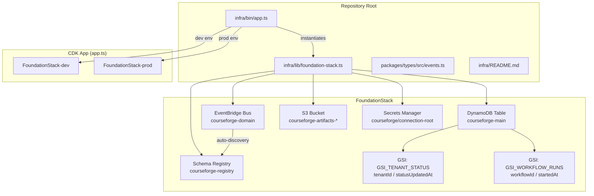

# Design Document: CourseForge Foundation Infrastructure

## Overview

This design defines the foundational AWS infrastructure for CourseForge Connect, provisioned entirely via AWS CDK v2 in TypeScript. The infrastructure lives in a new `infra/` directory at the repository root, separate from the existing `src/` application code. A new `packages/types/` directory provides shared TypeScript type definitions consumed by both the infrastructure and application layers.

The core deliverable is a single `FoundationStack` CDK stack that provisions:
- A custom EventBridge event bus with schema auto-discovery
- A single-table DynamoDB table with two GSIs
- A versioned, encrypted S3 artifact bucket with lifecycle rules
- A Secrets Manager placeholder secret for IAM anchoring

A CDK app entry point instantiates this stack for dev and prod environments using CDK context variables.

No application logic (Lambda handlers, Step Functions, etc.) is included. This is infrastructure-as-code only.

## Architecture



### Directory Layout

```
repo-root/
├── infra/
│   ├── bin/
│   │   └── app.ts              # CDK app entry point
│   ├── lib/
│   │   └── foundation-stack.ts # FoundationStack construct
│   ├── test/
│   │   └── foundation-stack.test.ts
│   ├── cdk.json
│   ├── tsconfig.json
│   ├── package.json
│   └── README.md
├── packages/
│   └── types/
│       ├── src/
│       │   ├── events.ts       # DomainEvent, WorkflowStatus, RunStatus
│       │   └── index.ts        # Re-exports
│       ├── tsconfig.json
│       └── package.json
├── src/                        # Existing application code (unchanged)
├── package.json                # Existing root package.json
└── tsconfig.json               # Existing root tsconfig
```

### Design Decisions

1. **Separate `infra/` directory**: CDK projects have their own dependency tree (`aws-cdk-lib`, `constructs`). Keeping infra separate avoids polluting the application `package.json` and allows independent `cdk synth`/`cdk deploy` workflows.

2. **`packages/types/` for shared types**: The `DomainEvent` interface and status enums are contracts shared between infrastructure (for EventBridge schema validation) and application code. A dedicated package avoids circular dependencies and can be referenced via TypeScript path aliases or npm workspaces.

3. **Single FoundationStack**: All foundational resources live in one stack. This simplifies deployment ordering and CloudFormation output cross-referencing. The stack accepts `env` (account/region) as a constructor parameter to support multi-environment instantiation.

4. **CDK context for environment config**: Using `cdk.json` context keys (`dev_account`, `prod_account`) keeps environment-specific values out of code and supports CI/CD override via `--context` flags.

## Components and Interfaces

### FoundationStack (CDK Stack)

**Location**: `infra/lib/foundation-stack.ts`

```typescript
import * as cdk from 'aws-cdk-lib';
import { Construct } from 'constructs';

export interface FoundationStackProps extends cdk.StackProps {
  // env (account, region) inherited from StackProps
}

export class FoundationStack extends cdk.Stack {
  public readonly eventBusArn: string;
  public readonly eventBusName: string;
  public readonly mainTableName: string;
  public readonly mainTableArn: string;
  public readonly artifactBucketName: string;

  constructor(scope: Construct, id: string, props: FoundationStackProps) {
    super(scope, id, props);
    // Resource construction detailed below
  }
}
```

### Resource Construction Details

#### EventBridge Event Bus & Schema Registry
- `aws_events.EventBus` with `eventBusName: 'courseforge-domain'`
- `aws_eventschemas.CfnRegistry` with `registryName: 'courseforge-registry'`
- `aws_eventschemas.CfnDiscoverer` linking the bus to the registry with `sourceArn` set to the bus ARN
- CloudFormation outputs: `EventBusArn`, `EventBusName`

#### DynamoDB Table
- `aws_dynamodb.Table` with `tableName: 'courseforge-main'`
- Partition key: `PK` (String), Sort key: `SK` (String)
- Billing: `PAY_PER_REQUEST`
- Point-in-time recovery: enabled
- Encryption: `AWS_DEFAULT` (AWS-managed KMS)
- GSI `GSI_TENANT_STATUS`: PK=`tenantId` (String), SK=`statusUpdatedAt` (String)
- GSI `GSI_WORKFLOW_RUNS`: PK=`workflowId` (String), SK=`startedAt` (String)
- CloudFormation outputs: `MainTableName`, `MainTableArn`

#### S3 Artifact Bucket
- `aws_s3.Bucket` with `bucketName: \`courseforge-artifacts-${account}-${region}\``
- Versioning: enabled
- Encryption: `S3_MANAGED` (SSE-S3)
- Lifecycle rule: transition to `INTELLIGENT_TIERING` after 90 days
- `blockPublicAccess: BlockPublicAccess.BLOCK_ALL`
- CloudFormation output: `ArtifactBucketName`

#### Secrets Manager Secret
- `aws_secretsmanager.Secret` with `secretName: 'courseforge/connection-root'`
- Initial value: placeholder string (e.g., `{"purpose": "IAM anchor for courseforge connection secrets"}`)

### CDK App Entry Point

**Location**: `infra/bin/app.ts`

```typescript
const app = new cdk.App();

const devAccount = app.node.tryGetContext('dev_account') ?? 'REPLACE_WITH_DEV_ACCOUNT';
const devRegion = app.node.tryGetContext('dev_region') ?? 'us-east-1';
const prodAccount = app.node.tryGetContext('prod_account') ?? 'REPLACE_WITH_PROD_ACCOUNT';
const prodRegion = app.node.tryGetContext('prod_region') ?? 'us-east-1';

new FoundationStack(app, 'FoundationStack-dev', {
  env: { account: devAccount, region: devRegion },
});

new FoundationStack(app, 'FoundationStack-prod', {
  env: { account: prodAccount, region: prodRegion },
});
```

### Shared Type Definitions

**Location**: `packages/types/src/events.ts`

```typescript
export interface DomainEvent {
  tenantId: string;
  workflowId: string;
  eventType: string;
  payload: unknown;
  traceId: string;
  timestamp: string; // ISO 8601
}

export enum WorkflowStatus {
  DRAFT = 'DRAFT',
  PUBLISHED = 'PUBLISHED',
  PAUSED = 'PAUSED',
  ARCHIVED = 'ARCHIVED',
}

export enum RunStatus {
  PENDING = 'PENDING',
  RUNNING = 'RUNNING',
  SUCCESS = 'SUCCESS',
  FAILED = 'FAILED',
  REPLAYING = 'REPLAYING',
}
```

**Location**: `packages/types/src/index.ts`
- Re-exports `DomainEvent`, `WorkflowStatus`, `RunStatus` from `./events`.


## Data Models

### DynamoDB Single-Table Key Schema

| Entity | PK | SK | Attributes |
|---|---|---|---|
| Workflow | `WF#{workflowId}` | `META` | tenantId, name, status, config, dsl, createdAt, updatedAt |
| Run | `WF#{workflowId}` | `RUN#{startedAt}#{runId}` | tenantId, status, startedAt, completedAt, result |

### GSI Access Patterns

| GSI | PK | SK | Use Case |
|---|---|---|---|
| GSI_TENANT_STATUS | `tenantId` | `statusUpdatedAt` | List workflows/runs by tenant filtered by status and time |
| GSI_WORKFLOW_RUNS | `workflowId` | `startedAt` | List runs for a specific workflow ordered by start time |

### Access Patterns

1. **Get workflow by ID**: Query PK=`WF#{workflowId}`, SK=`META`
2. **List runs by workflow**: Query PK=`WF#{workflowId}`, SK begins_with `RUN#`
3. **List runs by tenant and status**: Query GSI_TENANT_STATUS with PK=`{tenantId}`, SK range
4. **Get run by ID**: Query PK=`WF#{workflowId}`, SK=`RUN#{startedAt}#{runId}`

### CloudFormation Outputs

| Output Key | Value | Purpose |
|---|---|---|
| EventBusArn | Event bus ARN | Cross-stack references for event producers/consumers |
| EventBusName | `courseforge-domain` | Event rule targeting |
| MainTableName | `courseforge-main` | Application layer table access |
| MainTableArn | Table ARN | IAM policy construction |
| ArtifactBucketName | `courseforge-artifacts-{account}-{region}` | Application layer bucket access |


## Correctness Properties

*A property is a characteristic or behavior that should hold true across all valid executions of a system — essentially, a formal statement about what the system should do. Properties serve as the bridge between human-readable specifications and machine-verifiable correctness guarantees.*

This infrastructure spec is primarily declarative CDK code. Most acceptance criteria specify exact resource names, configurations, and outputs — these are best validated by example-based CDK template assertions (snapshot/fine-grained assertions on the synthesized CloudFormation template). There is one property-based testing opportunity around the shared type definitions.

### Property 1: DomainEvent serialization round trip

*For any* valid `DomainEvent` object (with arbitrary string values for tenantId, workflowId, eventType, traceId, timestamp, and any JSON-serializable payload), serializing to JSON and deserializing back should produce an object deeply equal to the original.

**Validates: Requirements 6.1**

This is a round-trip property. Since `DomainEvent` is the contract for EventBridge messages, ensuring it survives JSON serialization is critical — events will be serialized/deserialized across service boundaries.

## Error Handling

Since this spec is infrastructure-only (CDK constructs, no runtime application logic), error handling is limited to:

1. **CDK Synthesis Errors**: If required context keys are missing, the CDK app uses placeholder values (e.g., `REPLACE_WITH_DEV_ACCOUNT`) rather than failing synthesis. This allows `cdk synth` to succeed for template inspection even without environment configuration.

2. **CloudFormation Deployment Errors**: Resource naming conflicts (e.g., a bucket with the same name already exists) will surface as CloudFormation deployment failures. These are handled by CloudFormation's built-in rollback mechanism.

3. **Type Safety**: The shared type definitions in `packages/types/` use TypeScript's type system to catch contract violations at compile time. The `payload` field on `DomainEvent` is typed as `unknown` to allow flexibility while requiring explicit type narrowing at consumption sites.

## Testing Strategy

### Dual Testing Approach

Testing for this infrastructure spec uses two complementary strategies:

**Unit Tests (CDK Template Assertions)**:
CDK provides `aws-cdk-lib/assertions` for fine-grained template assertions on synthesized CloudFormation templates. These are example-based tests that verify specific resource configurations.

Tests will be located at `infra/test/foundation-stack.test.ts` and will:
- Synthesize the `FoundationStack` into a CloudFormation template
- Use `Template.fromStack()` to make assertions
- Verify each resource type, name, configuration, GSI definitions, lifecycle rules, encryption settings, and CloudFormation outputs
- Verify CDK app instantiates stacks for both environments
- Verify placeholder context fallback behavior

Test groupings:
1. **EventBridge resources**: Bus name, registry name, discoverer linkage, outputs (validates 1.1–1.5)
2. **DynamoDB resources**: Table name, key schema, billing mode, PITR, encryption, both GSIs, outputs (validates 2.1–2.9)
3. **S3 resources**: Bucket name pattern, versioning, SSE-S3, lifecycle rule, public access block, output (validates 3.1–3.6)
4. **Secrets Manager**: Secret name, placeholder value (validates 4.1–4.2)
5. **CDK App**: Dev/prod stack instantiation, placeholder fallback (validates 5.1–5.2, 5.4)

**Shared Types Tests** (located at `packages/types/src/events.test.ts`):
1. **Enum value verification**: WorkflowStatus has exactly DRAFT, PUBLISHED, PAUSED, ARCHIVED; RunStatus has exactly PENDING, RUNNING, SUCCESS, FAILED, REPLAYING (validates 6.2, 6.3)
2. **Re-export verification**: All types/enums importable from index.ts (validates 6.4)

**Property-Based Tests**:
Using `fast-check` (already in the project's devDependencies), located at `packages/types/src/events.property.test.ts`:

1. **DomainEvent serialization round trip** — generates random DomainEvent instances and verifies JSON round-trip fidelity
   - Minimum 100 iterations
   - Tag: `Feature: courseforge-foundation-infra, Property 1: DomainEvent serialization round trip`

Each property-based test MUST:
- Reference its design document property number in a comment
- Use `fast-check` arbitraries to generate random inputs
- Run a minimum of 100 iterations
- Follow the tag format: `Feature: courseforge-foundation-infra, Property {number}: {property_text}`

**Documentation Tests** (validates 7.2–7.5):
- Verify `/infra/README.md` contains required sections: CDK context variables, DynamoDB key schema, access patterns, and Secrets Manager naming convention

### Test Framework Configuration

- **CDK tests**: vitest + `aws-cdk-lib/assertions` (in `infra/` package)
- **Type tests**: vitest + `fast-check` (in `packages/types/` package)
- Each package will have its own `vitest.config.ts` scoped to its test files
