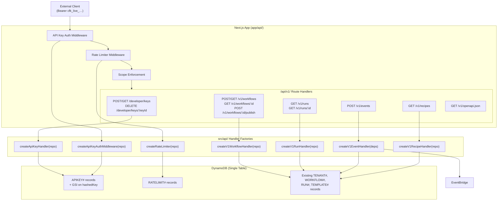

# Design Document: Developer REST API

## Overview

The Developer REST API adds a public, versioned (`/api/v1/`) programmatic interface to CourseForge Connect. It enables EdTech developers to manage workflows, trigger events, query runs, and browse recipes using API keys instead of the dashboard UI. The feature introduces three cross-cutting concerns — API key lifecycle management, bearer-token authentication middleware, and per-tenant token-bucket rate limiting — layered on top of new versioned route handlers that delegate to existing domain logic. An auto-generated OpenAPI 3.1 specification powers an embedded Swagger UI documentation page, and a Developer Portal page provides key management and usage statistics.

The design follows the existing codebase conventions:
- Pure handler factories (`createXxxHandler(deps)`) in `src/api/` with injected repository interfaces
- Thin Next.js route files in `app/api/` that wire DynamoDB clients to handlers
- Shared types in `packages/types/src/` and utilities in `packages/utils/src/`
- DynamoDB single-table design with `PK`/`SK` key patterns from `src/models/schema.ts`
- EventBridge for domain events via `courseforge.trigger` source
- `vitest` + `fast-check` for unit and property-based testing

## Architecture



### Key Design Decisions

1. **Middleware chain order**: Auth → Rate Limit → Scope. Auth runs first so rate limiting is per-tenant (not per-anonymous-request). Scope runs last so 401/429 take precedence over 403.

2. **API key format**: `cfk_live_{base64url(32 random bytes)}`. The prefix makes keys identifiable in logs and secret scanners. Only the SHA-256 hash is stored; the raw key is returned once at creation.

3. **GSI for key lookup**: A GSI on `hashedKey` enables O(1) lookup during authentication without scanning. This is the only new GSI required.

4. **Token bucket in DynamoDB**: Uses conditional writes (`attribute_exists` + version counter) for optimistic concurrency. Tokens refill proportionally based on elapsed time, avoiding a separate scheduled refill process.

5. **Versioned routes**: All public API routes live under `/api/v1/` to allow future breaking changes under `/api/v2/`. Key management routes live under `/api/developer/` since they are portal-facing.

6. **Delegation to existing logic**: Workflow creation, publishing, run queries, and event triggering reuse existing handler factories and repositories. The v1 handlers are thin adapters that translate between the public API contract and internal interfaces.

## Components and Interfaces

### 1. API Key Manager (`src/api/developer-keys/handler.ts`)

```typescript
export interface ApiKeyRepository {
  create(record: ApiKeyRecord): Promise<void>;
  listByTenant(tenantId: string): Promise<ApiKeyRecord[]>;
  getByKeyId(tenantId: string, keyId: string): Promise<ApiKeyRecord | null>;
  revoke(tenantId: string, keyId: string, deletedAt: string): Promise<void>;
  findByHash(hashedKey: string): Promise<ApiKeyRecord | null>;
  updateLastUsed(tenantId: string, keyId: string, timestamp: string): Promise<void>;
}

export function createApiKeyHandler(repo: ApiKeyRepository): {
  create: (event: APIGatewayProxyEvent) => Promise<APIGatewayProxyResult>;
  list: (event: APIGatewayProxyEvent) => Promise<APIGatewayProxyResult>;
  revoke: (event: APIGatewayProxyEvent) => Promise<APIGatewayProxyResult>;
};
```

### 2. API Key Auth Middleware (`src/api/middleware/api-key-auth.ts`)

```typescript
export interface AuthContext {
  tenantId: string;
  scope: 'read' | 'write';
  keyId: string;
}

export function createApiKeyAuthMiddleware(
  repo: Pick<ApiKeyRepository, 'findByHash' | 'updateLastUsed'>,
): (event: APIGatewayProxyEvent) => Promise<AuthContext | APIGatewayProxyResult>;
```

Returns `AuthContext` on success or an `APIGatewayProxyResult` (401) on failure. The caller checks the return type to decide whether to proceed.

### 3. Rate Limiter (`src/api/middleware/rate-limiter.ts`)

```typescript
export interface RateLimitRepository {
  getAndUpdate(
    tenantId: string,
    endpointGroup: EndpointGroup,
    now: number,
    capacity: number,
    windowSeconds: number,
  ): Promise<{ allowed: boolean; retryAfterSeconds: number }>;
}

export type EndpointGroup = 'read' | 'write' | 'events';

export function classifyEndpointGroup(method: string, path: string): EndpointGroup;

export function createRateLimiter(
  repo: RateLimitRepository,
  config?: { capacity?: number; windowSeconds?: number },
): (tenantId: string, method: string, path: string) => Promise<
  { allowed: true } | { allowed: false; retryAfterSeconds: number }
>;
```

### 4. Scope Enforcer (`src/api/middleware/scope-enforcer.ts`)

```typescript
export function enforceScopeForRequest(
  scope: 'read' | 'write',
  method: string,
  path: string,
): APIGatewayProxyResult | null;
// Returns null if allowed, or a 403 response if denied.
```

### 5. V1 Route Handlers

These are thin adapters in `src/api/v1/` that delegate to existing domain logic:

- `src/api/v1/workflows.ts` — delegates to existing workflow handlers + publish logic
- `src/api/v1/runs.ts` — delegates to existing `RunRepository`
- `src/api/v1/events.ts` — delegates to existing EventBridge + run creation logic
- `src/api/v1/recipes.ts` — queries template records

### 6. OpenAPI Spec Generator (`src/api/v1/openapi.ts`)

```typescript
export function generateOpenApiSpec(): Record<string, unknown>;
```

Returns a static OpenAPI 3.1 JSON object. The spec is built at module load time (not dynamically generated per request) since the route definitions are fixed.

### 7. Developer Portal Page (`app/(dashboard)/developer/page.tsx`)

React page that calls `/api/developer/keys` for key management and displays usage stats.

### 8. Swagger UI Page (`app/(dashboard)/developer/docs/page.tsx`)

Static page that loads Swagger UI from `unpkg.com/swagger-ui-dist` CDN pointing at `/api/v1/openapi.json`.

## Data Models

### ApiKey Record (DynamoDB)

| Field | Type | Description |
|-------|------|-------------|
| PK | `TENANT#{tenantId}` | Partition key |
| SK | `APIKEY#{keyId}` | Sort key |
| keyId | string | UUID v4 |
| tenantId | string | Owning tenant |
| name | string | User-provided label |
| hashedKey | string | SHA-256 hex of raw key |
| scope | `'read' \| 'write'` | Permission level |
| createdBy | string | User ID of creator |
| createdAt | string | ISO 8601 |
| lastUsedAt | string \| null | ISO 8601, updated async |
| enabled | boolean | `true` until revoked |
| deletedAt | string \| null | ISO 8601 when revoked |
| GSI_HASHED_KEY_PK | string | = `hashedKey` (GSI partition key) |

**New GSI**: `GSI_HASHED_KEY` with partition key `GSI_HASHED_KEY_PK` projecting all attributes. This enables O(1) auth lookup.

### Rate Limit Bucket Record (DynamoDB)

| Field | Type | Description |
|-------|------|-------------|
| PK | `RATELIMIT#{tenantId}#{endpointGroup}` | Partition key |
| SK | `BUCKET` | Sort key (constant) |
| tokens | number | Current token count |
| lastRefillAt | number | Unix epoch ms of last refill |
| version | number | Optimistic lock counter |

### Schema Key Builders (additions to `src/models/schema.ts`)

```typescript
export function apiKeySK(keyId: string): string {
  return `APIKEY#${keyId}`;
}

export function rateLimitPK(tenantId: string, endpointGroup: string): string {
  return `RATELIMIT#${tenantId}#${endpointGroup}`;
}

export const RATE_LIMIT_SK = 'BUCKET';
export const GSI_HASHED_KEY = 'GSI_HASHED_KEY';
```

### Token Bucket Algorithm

```
on request(tenantId, endpointGroup):
  bucket = DynamoDB.get(PK=RATELIMIT#{tenantId}#{endpointGroup}, SK=BUCKET)
  if bucket not found:
    bucket = { tokens: capacity, lastRefillAt: now, version: 0 }

  elapsed = now - bucket.lastRefillAt
  refillTokens = floor(elapsed / windowMs * capacity)
  newTokens = min(capacity, bucket.tokens + refillTokens)

  if newTokens < 1:
    return 429, retryAfter = ceil((1 - newTokens) / (capacity / windowSeconds))

  DynamoDB.update(
    tokens = newTokens - 1,
    lastRefillAt = now,
    version = bucket.version + 1,
    ConditionExpression: version = :oldVersion
  )
  // On ConditionalCheckFailedException → retry (optimistic lock)
```


## Correctness Properties

*A property is a characteristic or behavior that should hold true across all valid executions of a system — essentially, a formal statement about what the system should do. Properties serve as the bridge between human-readable specifications and machine-verifiable correctness guarantees.*

### Property 1: API key creation round-trip

*For any* valid `(name, scope)` pair where name is a non-empty string and scope is `'read'` or `'write'`, creating an API key SHALL produce a response where: (a) the `key` field matches the pattern `cfk_live_[A-Za-z0-9_-]+`, (b) `SHA-256(key)` equals the `hashedKey` stored in the repository, (c) the stored record contains all required fields (`keyId`, `tenantId`, `name`, `hashedKey`, `scope`, `createdBy`, `createdAt`, `lastUsedAt`, `enabled=true`), and (d) the response contains `keyId`, `key`, `scope`, and `name`.

**Validates: Requirements 1.1, 1.3, 1.4**

### Property 2: API key listing returns all keys with required fields and no secrets

*For any* tenant with N created API keys, listing keys SHALL return exactly N items, each containing `keyId`, `name`, `scope`, `createdBy`, `createdAt`, `lastUsedAt`, and `enabled`, and no item SHALL contain `hashedKey` or the raw key value.

**Validates: Requirements 2.1, 2.2, 1.4**

### Property 3: API key revocation sets enabled to false

*For any* enabled API key belonging to the authenticated tenant, revoking it SHALL set `enabled` to `false` and record a valid ISO 8601 `deletedAt` timestamp.

**Validates: Requirements 3.1**

### Property 4: Auth middleware correctness

*For any* Bearer token, the auth middleware SHALL return an `AuthContext` with the correct `tenantId` and `scope` if and only if `SHA-256(token)` matches an `ApiKeyRecord` with `enabled=true`; otherwise it SHALL return a 401 response with body `{ "error": "Invalid or revoked API key" }`.

**Validates: Requirements 4.1, 4.2, 4.3, 4.5**

### Property 5: Endpoint group classification

*For any* HTTP method and path, `classifyEndpointGroup` SHALL return `'events'` when method is POST and path matches `/api/v1/events`, `'read'` when method is GET, and `'write'` for all other POST, PUT, and DELETE requests.

**Validates: Requirements 5.2**

### Property 6: Token bucket refill calculation

*For any* bucket state `(tokens, lastRefillAt, capacity, windowSeconds)` and current time `now`, the refill calculation SHALL produce `min(capacity, tokens + floor((now - lastRefillAt) / windowMs * capacity))` new tokens, then deduct one if available, returning `allowed=true`; or return `allowed=false` with a correct `retryAfterSeconds` if no tokens are available after refill.

**Validates: Requirements 5.4, 5.5**

### Property 7: Token bucket boundary enforcement

*For any* tenant and endpoint group with default capacity 100, exactly 100 requests within a single 60-second window SHALL all be allowed, and the 101st request within the same window SHALL receive a 429 response.

**Validates: Requirements 5.3, 18.1, 18.2**

### Property 8: Token bucket refill restores capacity

*For any* exhausted token bucket (0 tokens remaining), advancing time by at least the full window duration SHALL refill the bucket to full capacity, and the next request SHALL be allowed.

**Validates: Requirements 18.3**

### Property 9: Invalid input validation returns 400

*For any* request body that is missing required fields or contains invalid field values (e.g., empty name, invalid scope for key creation; missing name/recipeId for workflow creation; missing workflowId/payload for event triggering), the handler SHALL return a 400 status code with a descriptive error message.

**Validates: Requirements 1.2, 7.2, 11.4**

### Property 10: Scope enforcement

*For any* HTTP request, if the API key scope is `'read'` and the method is POST, PUT, or DELETE, the scope enforcer SHALL return a 403 response with body `{ "error": "Insufficient scope" }`; if the method is GET, the request SHALL be allowed regardless of scope.

**Validates: Requirements 14.1, 14.2, 14.3**

### Property 11: Event triggering ownership and status validation

*For any* `(tenantId, workflowId)` pair, the event endpoint SHALL return a successful response (202 with `runId` and `traceId`) if and only if the workflow belongs to the tenant and has status `PUBLISHED`; otherwise it SHALL return 409 with a descriptive error.

**Validates: Requirements 11.1, 11.2, 11.3**

### Property 12: Event triggering creates correct domain event and run record

*For any* valid event trigger request with `workflowId` and `payload`, the handler SHALL publish a `DomainEvent` to EventBridge with the correct `tenantId`, `workflowId`, `eventType`, `payload`, `traceId`, and `timestamp`, and SHALL create a Run record in DynamoDB with status `PENDING` and `triggerType` `'api'`.

**Validates: Requirements 11.2**

### Property 13: Workflow listing filters correctly

*For any* set of workflows and a filter query parameter (`status` or `environmentId`), the listing response SHALL contain only workflows matching the specified filter value.

**Validates: Requirements 8.2, 8.3**

### Property 14: Run listing filters and pagination

*For any* set of runs and filter parameters (`workflowId`, `status`), the listing response SHALL contain only matching runs. *For any* `limit` value, the response SHALL contain at most `limit` items (default 50). When a `cursor` is provided, the next page SHALL contain no duplicates from previous pages.

**Validates: Requirements 12.2, 12.3, 12.4**

### Property 15: Response masking excludes sensitive data

*For any* workflow detail response, compiled plan secrets SHALL be excluded. *For any* run listing response, sensitive payload data SHALL be excluded. *For any* run detail response, raw payloads SHALL be excluded.

**Validates: Requirements 9.2, 12.5, 13.2**

### Property 16: Recipe listing returns complete objects

*For any* set of template records in DynamoDB, the recipe listing endpoint SHALL return objects containing `id`, `name`, `description`, `category`, `standards`, and `estimatedMinutes` fields.

**Validates: Requirements 6.1**

## Error Handling

### HTTP Error Responses

All error responses follow a consistent JSON structure:

```json
{
  "error": "Human-readable error message"
}
```

| Status | Condition | Error Message |
|--------|-----------|---------------|
| 400 | Missing/invalid request body fields | Descriptive validation error |
| 401 | Missing or invalid API key | `"Invalid or revoked API key"` |
| 403 | Insufficient scope for operation | `"Insufficient scope"` |
| 404 | Resource not found or wrong tenant | `"Not found"` |
| 409 | Workflow not in triggerable state | `"Workflow is not in a triggerable state"` |
| 429 | Rate limit exceeded | `"Rate limit exceeded"` + `Retry-After` header |
| 500 | Unexpected server error | `"Internal server error"` |

### Rate Limiter Error Recovery

- On `ConditionalCheckFailedException` during token bucket update: retry up to 3 times with jitter
- On DynamoDB timeout: fail open (allow request) and log warning — availability over strict enforcement

### Auth Middleware Error Handling

- `lastUsedAt` update failures are logged but do not affect the request (fire-and-forget)
- GSI query failures return 500 (not 401) to avoid masking infrastructure issues

### Event Triggering Failures

- EventBridge `putEvents` failure: return 500, do not create Run record
- Run record creation failure after EventBridge publish: log error, return 500 — the event is already published but the run record is missing (eventual consistency handled by existing run-initializer Lambda)

## Testing Strategy

### Property-Based Tests (fast-check, minimum 100 iterations each)

Property-based tests target the pure logic components. Each test references its design property.

| Test File | Properties Covered | Description |
|-----------|-------------------|-------------|
| `src/api/developer-keys/handler.property.test.ts` | P1, P2, P3 | Key creation format/hash, listing shape, revocation |
| `src/api/middleware/api-key-auth.property.test.ts` | P4 | Auth middleware correctness |
| `src/api/middleware/rate-limiter.property.test.ts` | P5, P6, P7, P8 | Endpoint classification, token bucket math, boundary, refill |
| `src/api/middleware/scope-enforcer.property.test.ts` | P10 | Scope enforcement rules |
| `src/api/v1/events.property.test.ts` | P9 (events), P11, P12 | Event validation, ownership check, domain event creation |
| `src/api/v1/workflows.property.test.ts` | P9 (workflows), P13, P15 (workflows) | Workflow validation, filtering, masking |
| `src/api/v1/runs.property.test.ts` | P14, P15 (runs) | Run filtering, pagination, masking |
| `src/api/v1/recipes.property.test.ts` | P16 | Recipe listing field completeness |

Tag format: `// Feature: developer-rest-api, Property {N}: {title}`

### Unit Tests (vitest, example-based)

| Test File | Requirements Covered | Description |
|-----------|---------------------|-------------|
| `src/api/developer-keys/handler.test.ts` | 1.1–1.4, 2.1–2.2, 3.1–3.2 | Key CRUD happy paths, 404 for wrong tenant |
| `src/api/middleware/api-key-auth.test.ts` | 4.1–4.5 | Auth happy path, disabled key, missing header, lastUsedAt update |
| `src/api/middleware/rate-limiter.test.ts` | 5.1–5.6, 18.1–18.3 | Token bucket init, exhaustion, refill, conditional write |
| `src/api/middleware/scope-enforcer.test.ts` | 14.1–14.3 | Scope enforcement examples |
| `src/api/v1/events.test.ts` | 11.1–11.5 | Event triggering happy path, 409, 400, scope check |
| `src/api/v1/workflows.test.ts` | 7.1–7.3, 8.1–8.4, 9.1–9.4, 10.1–10.3 | Workflow CRUD, filtering, detail, publish |
| `src/api/v1/runs.test.ts` | 12.1–12.6, 13.1–13.4 | Run listing, detail, pagination, masking |
| `src/api/v1/recipes.test.ts` | 6.1–6.2 | Recipe listing, scope check |
| `src/api/v1/openapi.test.ts` | 15.1–15.6 | OpenAPI spec structure validation |

### Integration / Smoke Tests

| Test | Requirements | Description |
|------|-------------|-------------|
| OpenAPI route smoke test | 15.6 | GET `/api/v1/openapi.json` without auth returns 200 |
| Rate limiter conditional write | 5.6 | Verify DynamoDB conditional expression is used |
| End-to-end key lifecycle | 1–4 | Create key → authenticate → list → revoke → auth fails |

### UI Component Tests

| Test | Requirements | Description |
|------|-------------|-------------|
| Developer Portal render | 17.1–17.5 | Key list, create modal, revoke dialog, docs link, stats |
| Swagger UI page | 16.1–16.2 | Renders with correct spec URL |
