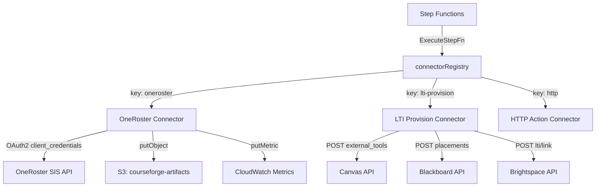
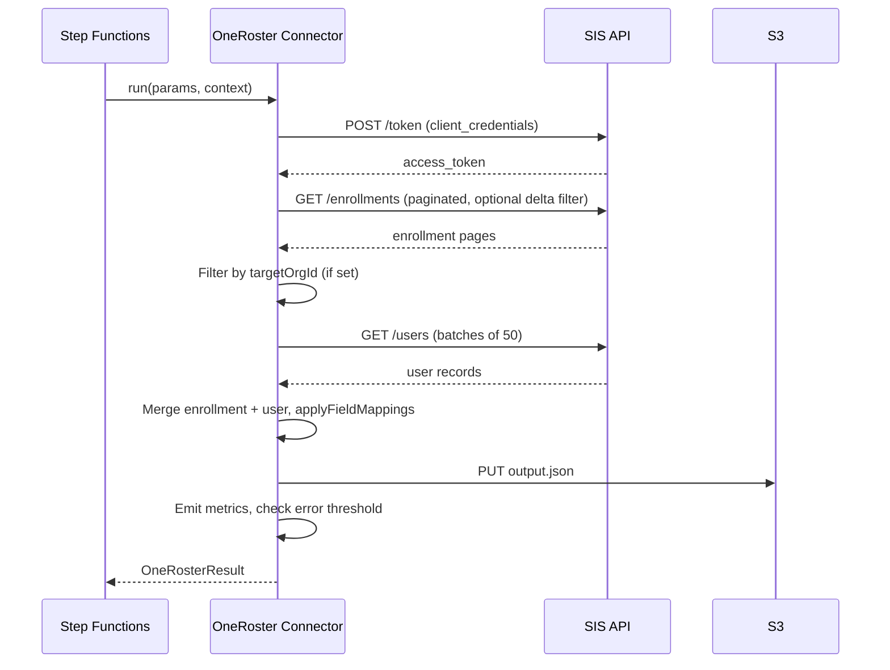
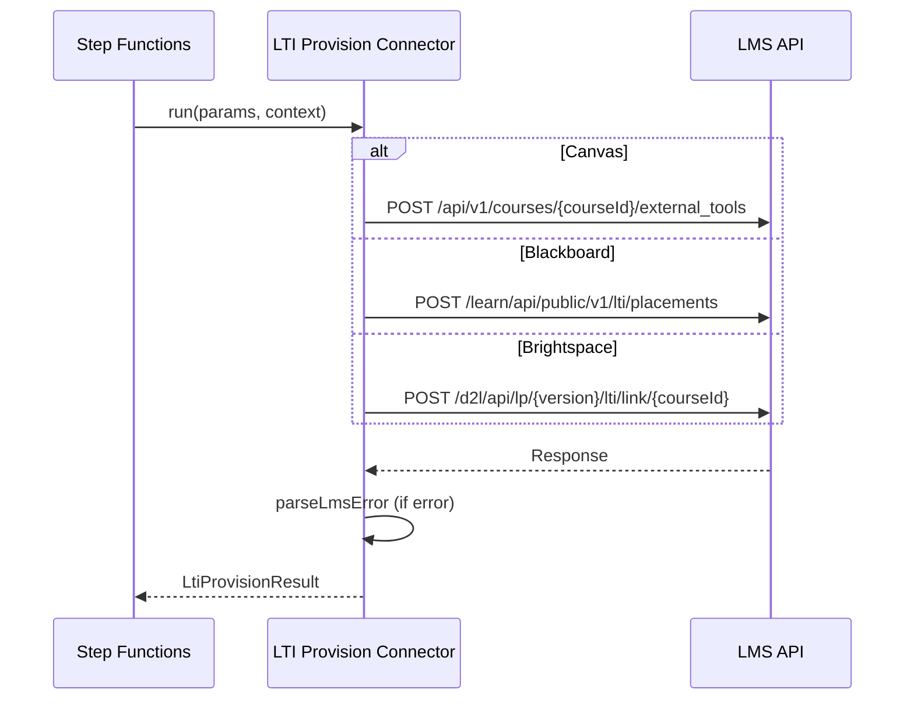

# Design Document: Education Standards Connectors

## Overview

This design documents the architecture of two education-standards connectors for CourseForge Connect:

1. **OneRoster Roster Sync** (`oneroster`) — Fetches enrollment and user data from a OneRoster v1.1-compliant SIS endpoint, applies configurable field mappings, writes results to S3, and emits CloudWatch metrics. Aborts when the error rate exceeds 20%.
2. **LTI 1.3 Tool Provisioning** (`lti-provision`) — Provisions LTI tool placements on Canvas, Blackboard, or Brightspace via their respective REST APIs, normalizing LMS-specific errors into a common `LtiError` structure.

Both connectors implement the `ConnectorDefinition<TParams, TResult>` interface and are registered in the `connectorRegistry` so that `ExecuteStepFn` can resolve and invoke them by key. No new Lambda functions or CDK infrastructure is required — the connectors are pure TypeScript modules invoked as Step Functions tasks.

## Architecture



### Data Flow — OneRoster Sync



### Data Flow — LTI Provisioning



## Components and Interfaces

### ConnectorDefinition\<TParams, TResult\>

The shared interface all connectors implement:

```typescript
interface ConnectorDefinition<TParams, TResult> {
  key: string;                    // Registry lookup key
  displayName: string;            // Human-readable name
  authType: 'oauth2' | 'apikey' | 'basic';
  credentialSchema: JSONSchema7;  // Validation schema for credentials
  testFn: (credentials: Record<string, unknown>) => Promise<boolean>;
  run: (params: TParams, context: ConnectorContext) => Promise<TResult>;
}
```

### OneRoster Connector

**Module:** `/packages/connectors/oneroster/index.ts`

Key exports:
- `oneRosterConnector: ConnectorDefinition<OneRosterParams, OneRosterResult>` — The connector definition
- `getAccessToken(baseUrl, clientId, clientSecret)` — OAuth2 token acquisition with in-memory cache
- `fetchEnrollments(baseUrl, token, since?)` — Paginated enrollment fetch with optional delta filter
- `fetchUsers(baseUrl, token, userIds)` — Batched user fetch (50 per request)
- `applyFieldMappings(record, mappings)` — Pure function that projects record fields via mappings
- `buildEnrollmentsUrl(baseUrl, since?)` — URL builder with delta filter query param
- `syncToTarget(records, context)` — Writes JSON to S3
- `BatchSyncThresholdError` — Thrown when error rate > 20%

### LTI Provision Connector

**Module:** `/packages/connectors/lti-provision/index.ts`

Key exports:
- `ltiProvisionConnector: ConnectorDefinition<LtiProvisionParams, LtiProvisionResult>` — The connector definition
- `parseLmsError(response, lmsType)` — Normalizes Canvas/Blackboard/Brightspace error responses into `LtiError`

Internal functions:
- `provisionCanvas(params)` — Canvas external tool creation
- `provisionBlackboard(params)` — Blackboard placement creation
- `provisionBrightspace(params)` — Brightspace LTI link creation with D2L signature
- `createD2LSignature(apiKey, secret, path)` — Base64url encoding of `{apiKey}:{secret}:{path}`

### Connector Registry

**Module:** `/packages/connectors/registry.ts`

```typescript
const connectorRegistry: Record<string, Connector> = {
  http: httpConnector,
  oneroster: oneRosterConnector,
  'lti-provision': ltiProvisionConnector,
};

function resolveConnector(connectorKey: string): Connector;
```

## Data Models

### OneRoster Types

```typescript
interface OneRosterParams {
  baseUrl: string;
  syncScope: 'delta' | 'full';
  targetOrgId?: string;
  lastSyncedAt?: string;
  fieldMappings: FieldMapping[];
  clientId?: string;
  clientSecret?: string;
}

interface FieldMapping {
  sourceField: string;
  targetField: string;
}

interface OneRosterResult {
  synced: number;
  added: number;
  updated: number;
  removed: number;
  errors: OneRosterSyncError[];
  lastSyncedAt: string;
}

interface OneRosterSyncError {
  recordId: string;
  recordType: 'user' | 'class' | 'enrollment';
  errorCode: string;
  message: string;
}
```

### LTI Provision Types

```typescript
interface LtiProvisionParams {
  lmsType: 'canvas' | 'blackboard' | 'brightspace';
  courseId: string;
  toolClientId: string;
  deploymentId?: string;
  toolName: string;
  launchUrl: string;
  customParams?: Record<string, string>;
  baseUrl?: string;
  apiKey?: string;
}

interface LtiProvisionResult {
  success: boolean;
  deploymentId: string;
  registrationId?: string;
  launchUrl: string;
  lmsToolId: string;
  message: string;
}

interface LtiError {
  lmsErrorCode: string;
  message: string;
  field?: string;
}
```

### ConnectorContext

```typescript
interface ConnectorContext {
  tenantId: string;
  runId: string;
  metrics?: {
    putMetric: (name: string, value: number, namespace: string) => void;
  };
  s3Client?: {
    putObject(input: { bucket: string; key: string; body: string; contentType: string }): Promise<unknown>;
  };
}
```


## Correctness Properties

*A property is a characteristic or behavior that should hold true across all valid executions of a system — essentially, a formal statement about what the system should do. Properties serve as the bridge between human-readable specifications and machine-verifiable correctness guarantees.*

### Property 1: Delta filter URL construction

*For any* base URL and any ISO 8601 timestamp string, `buildEnrollmentsUrl(baseUrl, since)` SHALL produce a URL whose `filter` query parameter equals `dateLastModified>'{since}'`, and when `since` is undefined the URL SHALL have no `filter` parameter.

**Validates: Requirements 3.1, 3.2**

### Property 2: Org filtering preserves only matching records

*For any* array of enrollment records with varying `schoolSourcedId` values and *for any* `targetOrgId`, filtering the array to records where `schoolSourcedId === targetOrgId` SHALL produce a result where every record's `schoolSourcedId` equals `targetOrgId` and no matching records from the original array are missing.

**Validates: Requirements 3.4**

### Property 3: User batching invariants

*For any* array of user ID strings (possibly containing duplicates and empty strings), the batching logic SHALL:
- produce batches where each batch contains at most 50 elements, and
- the union of all batch elements equals the set of unique non-empty IDs from the input (no duplicates, no omissions).

**Validates: Requirements 4.1, 4.2**

### Property 4: Field mapping correctness

*For any* record (object with string keys) and *for any* array of `FieldMapping` entries, `applyFieldMappings(record, mappings)` SHALL produce an output where:
- the output keys are exactly the set of `targetField` values from mappings whose `sourceField` exists on the input record,
- for each such mapping, `output[targetField] === record[sourceField]`, and
- no other keys are present in the output.

**Validates: Requirements 5.1, 5.2, 5.3, 5.4**

### Property 5: Error threshold behavior

*For any* non-negative integer `total` (enrollment count) and non-negative integer `errorCount` (≤ total):
- when `total > 0` and `errorCount / total > 0.2`, the connector SHALL throw a `BatchSyncThresholdError` with the correct error rate and total, and
- when `total === 0` or `errorCount / total ≤ 0.2`, the connector SHALL return a successful `OneRosterResult`.

**Validates: Requirements 7.1, 7.2, 7.3**

### Property 6: D2L signature computation

*For any* `apiKey`, `secret`, and `path` strings, `createD2LSignature(apiKey, secret, path)` SHALL return the base64url encoding of `{apiKey}:{secret}:{path}`.

**Validates: Requirements 11.2**

### Property 7: LMS error normalization

*For any* HTTP status code and *for any* of the three LMS types (canvas, blackboard, brightspace):
- when the response body is valid JSON, `parseLmsError` SHALL extract the LMS-specific error fields (Canvas: `errors[].message`; Blackboard: `code`, `message`; Brightspace: `ErrorCode`, `Message`) into a normalized `LtiError`, and
- when the response body is not valid JSON, `parseLmsError` SHALL use the HTTP status as `lmsErrorCode` and a default message for the LMS type.

**Validates: Requirements 12.1, 12.2, 12.3, 12.4**

### Property 8: Unknown connector key error contains key

*For any* string that is not a registered connector key, `resolveConnector(key)` SHALL throw an error whose message contains the unknown key string.

**Validates: Requirements 13.3**

## Error Handling

### OneRoster Connector

| Error Condition | Behavior |
|---|---|
| Token endpoint non-200 | Throws with HTTP status code |
| Token response missing `access_token` | Throws with descriptive message |
| Enrollment endpoint non-200 | Throws with HTTP status code |
| User batch fetch failure | Records `USER_FETCH_FAILED` error per enrollment; continues sync |
| Field mapping failure | Records `MAP_FAILED` error per enrollment; continues sync |
| Error rate > 20% | Throws `BatchSyncThresholdError` with rate and total |
| Missing `s3Client` | Throws with descriptive message |

The OneRoster connector uses a "collect errors, check threshold" pattern: individual record failures are accumulated into the `errors` array, and only when the overall error rate exceeds 20% does the connector abort with `BatchSyncThresholdError`. This allows partial syncs to succeed when a small number of records have issues.

### LTI Provision Connector

| Error Condition | Behavior |
|---|---|
| Canvas 422 | Returns `LtiProvisionResult` with `success: false` and normalized message |
| Canvas other non-200 | Throws with normalized `LtiError` |
| Blackboard non-200 | Throws with normalized `LtiError` |
| Brightspace non-200 | Throws with normalized `LtiError` |
| Unsupported `lmsType` | Throws `Unsupported LMS type` error |
| Unparseable JSON response | Falls back to HTTP status + default message per LMS |

Canvas 422 is treated as a soft failure (returns result with `success: false`) because it indicates validation errors that the caller may want to handle differently from hard failures.

### Registry

| Error Condition | Behavior |
|---|---|
| Unknown connector key | Throws with message containing the unknown key |

## Testing Strategy

### Unit Tests (Example-Based)

Unit tests cover specific scenarios, integration points, and edge cases:

- **Connector definitions**: Verify static properties (key, displayName, authType, credentialSchema) for both connectors
- **testFn behavior**: Verify correct URLs per LMS type, success/failure return values
- **Token management**: Verify caching behavior (single fetch for repeated calls)
- **Pagination**: Mock multi-page responses, verify all enrollments collected
- **S3 output**: Verify correct bucket, key path, and content type
- **Metric emission**: Verify correct metric names and values
- **LMS provisioning**: Verify correct POST URLs and payloads per LMS type
- **Registry**: Verify entries exist and unknown keys throw

### Property-Based Tests (fast-check)

Property tests verify universal correctness properties across generated inputs. Each test runs a minimum of 100 iterations.

| Property | Function Under Test | Generator Strategy |
|---|---|---|
| P1: Delta filter URL | `buildEnrollmentsUrl` | Random base URLs × optional ISO timestamps |
| P2: Org filtering | Array filter logic | Random enrollment arrays × random org IDs |
| P3: User batching | Batching logic in `fetchUsers` | Random string arrays with duplicates |
| P4: Field mapping | `applyFieldMappings` | Random records × random FieldMapping arrays |
| P5: Error threshold | Threshold check in `run` | Random (total, errorCount) pairs |
| P6: D2L signature | `createD2LSignature` | Random (apiKey, secret, path) triples |
| P7: Error normalization | `parseLmsError` | Random status codes × LMS types × JSON/non-JSON bodies |
| P8: Unknown key error | `resolveConnector` | Random strings not in registry |

Property tests use the `fast-check` library (already a dev dependency). Each test is tagged with:
```
Feature: education-standards-connectors, Property {N}: {title}
```

### Test File Organization

- `packages/connectors/oneroster/index.test.ts` — Unit tests for OneRoster connector
- `packages/connectors/oneroster/index.property.test.ts` — Property tests (P1–P5)
- `packages/connectors/lti-provision/index.test.ts` — Unit tests for LTI provision connector
- `packages/connectors/lti-provision/index.property.test.ts` — Property tests (P6–P7)
- `packages/connectors/registry.test.ts` — Unit + property tests for registry (P8)
