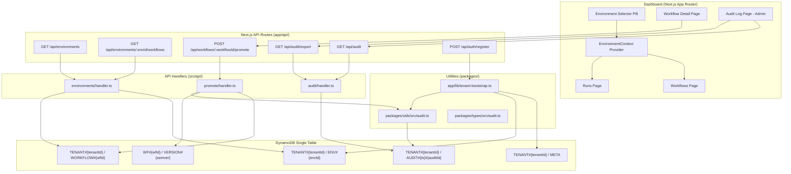

# Design Document: Environment Separation & Audit Log

## Overview

This design adds two foundational capabilities to CourseForge Connect:

1. **Environment Separation** — A dev/prod environment model that scopes workflows and runs by environment, supports promotion of published dev workflows to prod, and seeds default environments during tenant creation.
2. **Audit Log System** — A centralized, append-only audit log that records all security-relevant and lifecycle actions, with an admin-only query API, CSV export, and a read-only dashboard UI.

Both features build on the existing DynamoDB single-table design (PK/SK patterns) and Next.js API route architecture. No new AWS infrastructure is required.

### Key Design Decisions

- **Two-environment hard limit**: Only `dev` and `prod` are supported. Additional environments are a future paid-tier feature, enforced at the API layer.
- **Promotion creates a new workflow**: Promoting a dev workflow to prod creates a brand-new Workflow_Record (new workflowId) in the prod environment with DRAFT status, rather than moving or linking the original.
- **Audit writes are centralized**: A single `writeAuditLog` utility is the only path for writing audit entries, ensuring consistency and preventing bypasses.
- **Existing AUDIT# SK prefix reused**: The `auditSK(timestamp, id)` function in `src/models/schema.ts` already produces `AUDIT#{timestamp}#{id}` keys. The audit entry schema is expanded to cover all action types.
- **CSV export is streaming**: The export endpoint streams CSV rows to avoid loading all entries into memory.

## Architecture



## Components and Interfaces

### 1. Audit Types (`packages/types/src/audit.ts`)

Defines the `ActionType` enum and `AuditEntry` interface used across the platform.

```typescript
export enum ActionType {
  TENANT_CREATED = 'TENANT_CREATED',
  USER_INVITED = 'USER_INVITED',
  USER_ROLE_CHANGED = 'USER_ROLE_CHANGED',
  CONNECTION_CREATED = 'CONNECTION_CREATED',
  CONNECTION_TESTED = 'CONNECTION_TESTED',
  CONNECTION_ROTATED = 'CONNECTION_ROTATED',
  CONNECTION_DELETED = 'CONNECTION_DELETED',
  WORKFLOW_CREATED = 'WORKFLOW_CREATED',
  WORKFLOW_PUBLISHED = 'WORKFLOW_PUBLISHED',
  WORKFLOW_PAUSED = 'WORKFLOW_PAUSED',
  WORKFLOW_ARCHIVED = 'WORKFLOW_ARCHIVED',
  WORKFLOW_PROMOTED = 'WORKFLOW_PROMOTED',
  RUN_COMPLETED = 'RUN_COMPLETED',
  RUN_FAILED = 'RUN_FAILED',
  RUN_REPLAYED = 'RUN_REPLAYED',
  AUDIT_LOG_EXPORTED = 'AUDIT_LOG_EXPORTED',
}

export type ResourceType = 'workflow' | 'connection' | 'run' | 'user' | 'environment';

export interface AuditEntry {
  auditId: string;          // UUID v4
  tenantId: string;
  actor: string;            // userId or 'system'
  actorEmail: string;
  actionType: ActionType;
  resourceType: ResourceType;
  resourceId: string;
  detail: Record<string, unknown>;
  ipAddress: string;
  userAgent: string;
  timestamp: string;        // ISO 8601
}
```

### 2. Audit Utility (`packages/utils/src/audit.ts`)

Single entry point for writing audit records. Accepts a DynamoDB client interface for testability.

```typescript
export interface DynamoClient {
  put(params: { TableName: string; Item: Record<string, unknown> }): Promise<void>;
}

export type WriteAuditInput = Omit<AuditEntry, 'auditId' | 'timestamp'>;

export async function writeAuditLog(
  client: DynamoClient,
  tableName: string,
  entry: WriteAuditInput,
): Promise<void>;
```

### 3. Tenant Bootstrap (`app/lib/tenant-bootstrap.ts`)

Seeds a new tenant with a Tenant record, two Environment_Records (dev, prod), and an initial audit entry.

```typescript
export interface BootstrapInput {
  tenantId: string;
  adminUserId: string;
  adminEmail: string;
}

export async function bootstrapTenant(
  client: DynamoClient,
  tableName: string,
  input: BootstrapInput,
): Promise<void>;
```

### 4. Environment API Handler (`src/api/environments/handler.ts`)

Handles listing environments and listing workflows by environment.

```typescript
export interface EnvironmentRepository {
  listByTenant(tenantId: string): Promise<EnvironmentRecord[]>;
  countByTenant(tenantId: string): Promise<number>;
}

export interface WorkflowRepository {
  countByEnvironment(tenantId: string, environmentId: string): Promise<number>;
  listByEnvironment(tenantId: string, environmentId: string): Promise<WorkflowSummary[]>;
}

export function createListEnvironmentsHandler(
  envRepo: EnvironmentRepository,
  wfRepo: WorkflowRepository,
): (event: APIGatewayProxyEvent) => Promise<APIGatewayProxyResult>;

export function createListWorkflowsByEnvHandler(
  wfRepo: WorkflowRepository,
): (event: APIGatewayProxyEvent) => Promise<APIGatewayProxyResult>;
```

### 5. Promotion API Handler (`src/api/promote/handler.ts`)

Handles promoting a published dev workflow to prod.

```typescript
export interface PromoteRepository {
  getWorkflow(tenantId: string, workflowId: string): Promise<WorkflowRecord | null>;
  getLatestVersion(workflowId: string): Promise<WorkflowVersionRecord | null>;
  createWorkflow(record: WorkflowRecord): Promise<void>;
  createVersion(record: WorkflowVersionRecord): Promise<void>;
}

export function createPromoteHandler(
  repo: PromoteRepository,
  auditClient: { write: (entry: WriteAuditInput) => Promise<void> },
): (event: APIGatewayProxyEvent) => Promise<APIGatewayProxyResult>;
```

### 6. Audit API Handler (`src/api/audit/handler.ts`)

Handles querying and exporting audit entries. Admin-only.

```typescript
export interface AuditRepository {
  query(tenantId: string, filters: AuditFilters): Promise<{ entries: AuditEntry[]; nextCursor?: string }>;
  queryAll(tenantId: string, filters: AuditFilters): Promise<AuditEntry[]>;
}

export interface AuditFilters {
  actor?: string;
  actionType?: string;
  resourceType?: string;
  resourceId?: string;
  dateFrom?: string;
  dateTo?: string;
  limit?: number;
  cursor?: string;
}

export function createQueryAuditHandler(
  repo: AuditRepository,
): (event: APIGatewayProxyEvent) => Promise<APIGatewayProxyResult>;

export function createExportAuditHandler(
  repo: AuditRepository,
  auditWriter: { write: (entry: WriteAuditInput) => Promise<void> },
): (event: APIGatewayProxyEvent) => Promise<APIGatewayProxyResult>;
```

### 7. Environment Context (`app/context/EnvironmentContext.tsx`)

React context providing the selected environment to dashboard pages.

```typescript
export interface EnvironmentContextValue {
  environmentId: 'dev' | 'prod';
  setEnvironmentId: (id: 'dev' | 'prod') => void;
}
```

### 8. Environment Selector (`app/components/EnvironmentSelector.tsx`)

Pill toggle component (Dev / Prod) that updates the EnvironmentContext.

### 9. Audit Log UI (`app/(dashboard)/admin/audit/page.tsx`)

Admin-only page with filterable, paginated, read-only audit table and CSV export button.

## Data Models

### Environment Record

| Field | Type | Description |
|-------|------|-------------|
| PK | `TENANT#{tenantId}` | Partition key |
| SK | `ENV#{environmentId}` | Sort key |
| environmentId | `'dev' \| 'prod'` | Environment identifier |
| tenantId | string | Owning tenant |
| name | string | Display name ("Development", "Production") |
| description | string | Optional description |
| isDefault | boolean | Whether this is the default environment |
| createdAt | string (ISO 8601) | Creation timestamp |

### Expanded Audit Entry (DynamoDB)

| Field | Type | Description |
|-------|------|-------------|
| PK | `TENANT#{tenantId}` | Partition key |
| SK | `AUDIT#{ISO-timestamp}#{auditId}` | Sort key (unique via UUID suffix) |
| auditId | string (UUID v4) | Unique audit entry ID |
| tenantId | string | Owning tenant |
| actor | string | userId or `'system'` |
| actorEmail | string | Actor's email address |
| actionType | ActionType enum value | Type of action performed |
| resourceType | ResourceType | Kind of resource affected |
| resourceId | string | ID of the affected resource |
| detail | `Record<string, unknown>` | Action-specific metadata |
| ipAddress | string | Client IP address |
| userAgent | string | Client user agent |
| timestamp | string (ISO 8601) | When the action occurred |

### Key Access Patterns

| Pattern | PK | SK / Condition |
|---------|-----|----------------|
| List environments for tenant | `TENANT#{tenantId}` | `begins_with(SK, 'ENV#')` |
| List workflows for tenant+env | `TENANT#{tenantId}` | `begins_with(SK, 'WORKFLOW#')` + filter `environmentId` |
| Get workflow by ID | `TENANT#{tenantId}` | `WORKFLOW#{workflowId}` |
| Get latest version | `WF#{workflowId}` | `begins_with(SK, 'VERSION#')` (ScanIndexForward: false, Limit: 1) |
| Query audit entries | `TENANT#{tenantId}` | `begins_with(SK, 'AUDIT#')` |
| Query audit by date range | `TENANT#{tenantId}` | `SK BETWEEN 'AUDIT#{dateFrom}' AND 'AUDIT#{dateTo}\uffff'` |


## Correctness Properties

*A property is a characteristic or behavior that should hold true across all valid executions of a system — essentially, a formal statement about what the system should do. Properties serve as the bridge between human-readable specifications and machine-verifiable correctness guarantees.*

### Property 1: Bootstrap creates all required records

*For any* valid tenantId and adminUserId, calling `bootstrapTenant` should produce exactly four DynamoDB items: one Tenant record with PK `TENANT#{tenantId}` and SK `META`, one Environment_Record with environmentId `dev` and isDefault `true`, one Environment_Record with environmentId `prod` and isDefault `false`, and one Audit_Entry with actionType `TENANT_CREATED` and actor equal to the adminUserId.

**Validates: Requirements 1.1, 1.2, 1.3**

### Property 2: Environment limit enforcement

*For any* tenant that already has two Environment_Records, attempting to create a third environment should be rejected with HTTP 403, and the total count of Environment_Records for that tenant should remain two.

**Validates: Requirements 2.1, 2.2**

### Property 3: List environments returns enriched records

*For any* tenant with environments and workflows, calling the list environments handler should return exactly the tenant's Environment_Records, and each record's `workflowCount` field should equal the number of Workflow_Records with a matching environmentId.

**Validates: Requirements 3.1, 3.2, 3.3**

### Property 4: Environment ID validation

*For any* string that is not `'dev'` or `'prod'`, the list-workflows-by-environment handler should return HTTP 400. For `'dev'` or `'prod'`, it should return HTTP 200.

**Validates: Requirements 4.1, 4.2**

### Property 5: Workflow filtering by environment

*For any* tenant with workflows distributed across dev and prod environments, querying workflows for a specific environmentId should return only workflows whose environmentId matches, and the count should equal the number of workflows in that environment.

**Validates: Requirements 4.3, 4.4**

### Property 6: Promotion rejects invalid workflow state

*For any* workflow with environmentId other than `'dev'` or status other than `'PUBLISHED'`, the promote handler should return HTTP 400 and no new records should be created.

**Validates: Requirements 5.3, 5.4**

### Property 7: Promotion produces correct output

*For any* valid dev/PUBLISHED workflow with a published version, promoting it should create a new Workflow_Record with a different workflowId, environmentId `'prod'`, status `'DRAFT'`, and a new WorkflowVersion_Record whose compiledPlan matches the source version's compiledPlan. An Audit_Entry with actionType `WORKFLOW_PROMOTED` and detail containing both `sourceWorkflowId` and `targetWorkflowId` should also be written.

**Validates: Requirements 5.5, 5.6, 5.7, 5.8**

### Property 8: writeAuditLog produces well-formed entry

*For any* valid `WriteAuditInput`, calling `writeAuditLog` should write a DynamoDB item with PK `TENANT#{tenantId}`, SK matching `AUDIT#{timestamp}#{auditId}`, a valid UUID v4 auditId, a valid ISO 8601 timestamp, and all input fields (actor, actorEmail, actionType, resourceType, resourceId, detail, ipAddress, userAgent) preserved.

**Validates: Requirements 8.1, 8.2, 9.1, 9.4**

### Property 9: Audit SK uniqueness

*For any* two calls to `writeAuditLog` that produce the same ISO timestamp, the resulting SK values should be distinct because the auditId UUID suffix is unique per call.

**Validates: Requirements 8.4, 9.5, 13.3**

### Property 10: Audit filter correctness

*For any* set of audit entries and any combination of filter parameters (actor, actionType, resourceType, resourceId, dateFrom, dateTo), the filtered result should contain only entries where every specified filter criterion matches, and no matching entries should be excluded.

**Validates: Requirements 10.2**

### Property 11: Audit pagination correctness

*For any* set of N audit entries queried with a limit L where L < N, the first page should contain at most L entries and a non-null nextCursor. Using that cursor to fetch the next page should return entries that do not overlap with the first page, and the union of all pages should equal the full result set.

**Validates: Requirements 10.3**

### Property 12: CSV format correctness

*For any* set of audit entries, formatting them as CSV should produce output where every row contains exactly 7 columns (timestamp, actor, actorEmail, actionType, resourceType, resourceId, detail), the header row matches the expected column names, and each data row's values correspond to the source entry's fields.

**Validates: Requirements 11.3**

## Error Handling

| Scenario | Handler | Response |
|----------|---------|----------|
| Missing tenantId header | All environment/audit handlers | HTTP 400 `{ message: "Missing x-tenant-id header" }` |
| Invalid environmentId (not dev/prod) | List workflows by env | HTTP 400 `{ message: "environmentId must be 'dev' or 'prod'" }` |
| Environment limit reached | Create environment | HTTP 403 `{ message: "Environment limit reached (max 2)" }` |
| Workflow not found | Promote handler | HTTP 404 `{ message: "Workflow not found" }` |
| Workflow not in dev | Promote handler | HTTP 400 `{ message: "Only dev workflows can be promoted" }` |
| Workflow not PUBLISHED | Promote handler | HTTP 400 `{ message: "Only published workflows can be promoted" }` |
| Non-Admin role | Audit query/export | HTTP 403 `{ message: "Admin role required" }` |
| DynamoDB write failure in bootstrap | bootstrapTenant | Error propagated to caller (not swallowed) |
| DynamoDB PutItem failure in audit | writeAuditLog | Error logged to console, rethrown to caller |
| Invalid JSON body | Promote handler | HTTP 400 `{ message: "Invalid JSON in request body" }` |
| Invalid cursor | Audit query | HTTP 400 `{ message: "Invalid cursor" }` |

## Testing Strategy

### Property-Based Tests (fast-check)

The project will use **fast-check** for property-based testing, consistent with existing `.property.test.ts` files in the codebase. Each property test runs a minimum of 100 iterations.

| Test File | Properties Covered |
|-----------|-------------------|
| `app/lib/tenant-bootstrap.property.test.ts` | Property 1 (Bootstrap records) |
| `src/api/environments/handler.property.test.ts` | Properties 2, 3, 4, 5 (Environment API) |
| `src/api/promote/handler.property.test.ts` | Properties 6, 7 (Promotion logic) |
| `packages/utils/src/audit.property.test.ts` | Properties 8, 9 (writeAuditLog) |
| `src/api/audit/handler.property.test.ts` | Properties 10, 11 (Audit query/pagination) |
| `src/api/audit/csv.property.test.ts` | Property 12 (CSV formatting) |

Each test is tagged with: `Feature: env-separation-audit-log, Property {number}: {title}`

### Unit Tests (example-based)

| Test File | Coverage |
|-----------|----------|
| `app/lib/tenant-bootstrap.test.ts` | Happy path, DynamoDB error propagation (Req 1.4, 1.5) |
| `src/api/environments/handler.test.ts` | Missing tenantId (Req 3.4), response structure |
| `src/api/promote/handler.test.ts` | 404 not found (Req 5.2), 201 response shape (Req 5.8) |
| `src/api/audit/handler.test.ts` | Admin role check (Req 10.5, 11.5), export headers (Req 11.2), AUDIT_LOG_EXPORTED entry (Req 11.4) |
| `packages/types/src/audit.test.ts` | ActionType enum has exactly 16 values (Req 8.3) |
| `packages/utils/src/audit.test.ts` | Happy path resolve, error rethrow (Req 13.1, 13.2) |

### UI / Component Tests

| Test File | Coverage |
|-----------|----------|
| `app/context/EnvironmentContext.test.tsx` | Default to dev, localStorage persistence (Req 6.1–6.3) |
| `app/components/EnvironmentSelector.test.tsx` | Pill toggle rendering, click behavior (Req 6.4, 6.5) |
| `app/(dashboard)/admin/audit/page.test.tsx` | Table columns, filters, pagination, export button, read-only, 403 (Req 12.1–12.7) |
| Workflow detail promote button tests | Button visibility conditions, click behavior (Req 7.1–7.3) |
