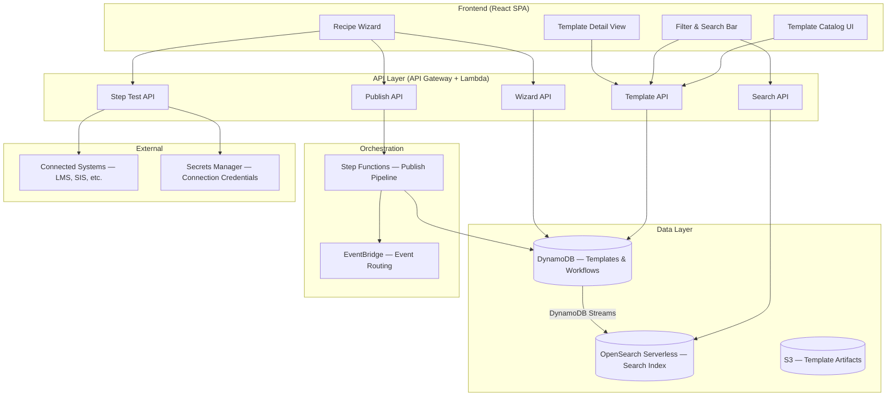

# Design Document — Recipe Library

## Overview

The Recipe Library is the primary discovery and activation surface for CourseForge Connect. It enables LMS Admins and Instructional Designers to browse curated workflow templates, inspect details, configure parameters through a guided wizard, test steps against live connected systems, and publish running workflows — all without writing code.

The system is composed of two major subsystems:

1. **Template Catalog** — A read-heavy browsable catalog with category filtering, full-text search, and detail views. Backed by DynamoDB with a search index.
2. **Recipe Wizard** — A multi-step configuration flow that collects parameters, validates inputs, supports per-step dry-run testing, serializes/deserializes Workflow DSL, and publishes workflows to the orchestration pipeline.

### Key Design Decisions

| Decision | Choice | Rationale |
|---|---|---|
| Template storage | DynamoDB single-table design | Consistent with existing workflow registry; supports category GSI and search patterns |
| Full-text search | DynamoDB Streams → OpenSearch Serverless | Enables keyword search across names/descriptions without scanning; serverless scales to zero |
| Wizard state | Client-side state with session storage | Keeps wizard responsive; avoids server round-trips for navigation; session storage persists across page refreshes within a session |
| DSL serialization | JSON-based Workflow DSL | Aligns with existing CourseForge DSL layer; JSON is human-readable and round-trippable |
| Step testing | Lambda-backed dry-run via API Gateway | Isolates test execution; reuses existing connection infrastructure |
| Publish pipeline | Step Functions state machine | Consistent with existing orchestration layer; handles multi-step publish atomically |

## Architecture



### Request Flow — Browse & Search

1. User opens Recipe Library → `GET /templates?category=...` hits Template API → DynamoDB query on category GSI
2. User types search query → `GET /search?q=...&category=...` hits Search API → OpenSearch query with optional category filter
3. Results returned, grouped by category on the client

### Request Flow — Wizard & Publish

1. User clicks "Configure" on a template → `GET /templates/{id}` fetches full template definition including step schema
2. Wizard renders steps from template schema; state held client-side in session storage
3. User clicks "Test this step" → `POST /steps/{stepId}/test` with step config → Lambda executes dry-run against connected system
4. User clicks "Publish" → `POST /workflows` with full serialized config → Publish API triggers Step Functions state machine
5. State machine: validate config → generate DSL → create Workflow record → activate pipeline → emit event to EventBridge
6. Success: return workflow ID, status, and first run link

## Components and Interfaces

### Template API

```
GET  /templates                    — List all templates (supports ?category= filter)
GET  /templates/{templateId}       — Get template detail
```

**Response shape — List:**
```json
{
  "templates": [
    {
      "templateId": "string",
      "name": "string",
      "description": "string",
      "categories": ["string"],
      "connectedSystems": ["string"],
      "timeToActivate": "string",
      "educationStandardTags": ["string"]
    }
  ],
  "groupedByCategory": {
    "Roster Ops": [...],
    "Course Lifecycle": [...],
    "Notifications": [...],
    "Analytics": [...]
  }
}
```

**Response shape — Detail:**
```json
{
  "templateId": "string",
  "name": "string",
  "description": "string",
  "categories": ["string"],
  "connectedSystems": ["string"],
  "requiredParameters": [...],
  "timeToActivate": "string",
  "educationStandardTags": ["string"],
  "stepCount": "number",
  "steps": [
    {
      "stepIndex": "number",
      "title": "string",
      "helpText": "string",
      "fields": [
        {
          "fieldId": "string",
          "label": "string",
          "type": "string",
          "required": "boolean",
          "helpText": "string",
          "validation": { "pattern": "string", "min": "number", "max": "number" },
          "connectedSystem": "string | null"
        }
      ]
    }
  ],
  "missingConnections": ["string"]
}
```

### Search API

```
GET  /search?q={query}&category={cat1,cat2}  — Full-text search with optional category filter
```

**Response shape:**
```json
{
  "results": [...],
  "totalCount": "number",
  "suggestions": ["string"]
}
```

When `totalCount` is 0, `suggestions` contains alternative search terms or category names.

### Step Test API

```
POST /steps/{stepId}/test
```

**Request:**
```json
{
  "templateId": "string",
  "stepIndex": "number",
  "configuration": { ... }
}
```

**Response:**
```json
{
  "result": "pass | fail",
  "details": "string",
  "suggestedFix": "string | null"
}
```

### Publish API

```
POST /workflows
```

**Request:**
```json
{
  "templateId": "string",
  "tenantId": "string",
  "name": "string",
  "configuration": { ... }
}
```

**Response:**
```json
{
  "workflowId": "string",
  "status": "active",
  "name": "string",
  "firstRunUrl": "string"
}
```

### Frontend Components

| Component | Responsibility |
|---|---|
| `TemplateCatalog` | Fetches and renders grouped template cards; manages filter/search state |
| `TemplateCard` | Displays summary: name, description, connected systems, time-to-activate, tags |
| `TemplateDetail` | Full template info, missing connection warnings, "Configure" CTA |
| `FilterBar` | Category multi-select checkboxes; persists selection to session storage |
| `SearchInput` | Debounced text input; triggers search API; clears to filter-only view |
| `RecipeWizard` | Multi-step form container; manages step navigation, progress indicator, state |
| `WizardStep` | Renders fields for a single step; inline help; per-field validation |
| `StepTestButton` | Triggers dry-run test; shows loading/pass/fail state |
| `PublishConfirmation` | Success screen with workflow name, status, monitoring link |
| `ValidationSummary` | Cross-step error summary; navigates to first error step |


## Data Models

### Template (DynamoDB)

| Attribute | Type | Description |
|---|---|---|
| `PK` | String | `TEMPLATE#{templateId}` |
| `SK` | String | `METADATA` |
| `templateId` | String | UUID |
| `name` | String | Display name |
| `description` | String | Full description (searchable) |
| `categories` | List\<String\> | One or more of: Roster Ops, Course Lifecycle, Notifications, Analytics, Assessment |
| `connectedSystems` | List\<String\> | e.g., `["Canvas LMS", "PowerSchool SIS"]` |
| `requiredParameters` | List\<Object\> | Parameter definitions |
| `timeToActivate` | String | e.g., `"5 min"` |
| `educationStandardTags` | List\<String\> | e.g., `["OneRoster", "LTI"]` |
| `steps` | List\<StepDefinition\> | Ordered wizard step schemas |
| `certified` | Boolean | CourseForge certified flag |
| `createdAt` | String (ISO 8601) | Creation timestamp |

**GSI — CategoryIndex:**
- `GSI1PK`: `CATEGORY#{categoryName}`
- `GSI1SK`: `TEMPLATE#{templateId}`

This supports efficient queries like "all templates in Roster Ops". Templates with multiple categories have items projected into each category partition.

### StepDefinition (embedded in Template)

| Attribute | Type | Description |
|---|---|---|
| `stepIndex` | Number | 0-based order |
| `title` | String | Step display title |
| `helpText` | String | Inline help for the step |
| `fields` | List\<FieldDefinition\> | Fields in this step |

### FieldDefinition (embedded in StepDefinition)

| Attribute | Type | Description |
|---|---|---|
| `fieldId` | String | Unique within template |
| `label` | String | Display label |
| `type` | String | `text`, `select`, `number`, `boolean`, `connection` |
| `required` | Boolean | Whether field must be filled |
| `helpText` | String | Per-field inline help |
| `validation` | Object | `{ pattern?, min?, max?, options? }` |
| `connectedSystem` | String \| null | If non-null, this field references a connected system |

### Workflow (DynamoDB — existing table, extended)

| Attribute | Type | Description |
|---|---|---|
| `PK` | String | `TENANT#{tenantId}` |
| `SK` | String | `WORKFLOW#{workflowId}` |
| `workflowId` | String | UUID |
| `tenantId` | String | Owning tenant |
| `templateId` | String | Originating template |
| `name` | String | User-provided workflow name |
| `configuration` | Map | Serialized wizard parameters |
| `dslDefinition` | String | Generated Workflow DSL (JSON string) |
| `status` | String | `active`, `paused`, `failed` |
| `createdBy` | String | User ID |
| `createdAt` | String (ISO 8601) | Creation timestamp |
| `updatedAt` | String (ISO 8601) | Last update |

### WizardConfiguration (client-side, serialized to/from DSL)

```typescript
interface WizardConfiguration {
  templateId: string;
  steps: WizardStepConfig[];
}

interface WizardStepConfig {
  stepIndex: number;
  fields: Record<string, FieldValue>;
  testResult?: 'pass' | 'fail' | null;
}

type FieldValue = string | number | boolean | null;
```

### Workflow DSL Shape (JSON)

```json
{
  "version": "1.0",
  "templateId": "string",
  "name": "string",
  "steps": [
    {
      "stepIndex": 0,
      "action": "string",
      "parameters": { "fieldId": "value", ... },
      "connectedSystem": "string | null"
    }
  ],
  "metadata": {
    "tenantId": "string",
    "createdBy": "string",
    "createdAt": "string"
  }
}
```

### Serialization Functions

```typescript
function serializeConfig(config: WizardConfiguration, metadata: WorkflowMetadata): WorkflowDSL;
function deserializeConfig(dsl: WorkflowDSL): WizardConfiguration;
```

These functions form the round-trip pair validated by Property 1 (see Correctness Properties).

### Filter & Search State (session storage)

```typescript
interface CatalogState {
  selectedCategories: string[];  // persisted to sessionStorage
  searchQuery: string;           // not persisted (cleared on navigation)
}
```


## Correctness Properties

*A property is a characteristic or behavior that should hold true across all valid executions of a system — essentially, a formal statement about what the system should do. Properties serve as the bridge between human-readable specifications and machine-verifiable correctness guarantees.*

### Property 1: DSL Serialization Round-Trip

*For any* valid `WizardConfiguration`, serializing it to a `WorkflowDSL` definition and then deserializing back should produce a configuration equivalent to the original input.

**Validates: Requirements 9.1, 9.2, 9.3**

### Property 2: Template Grouping by Category

*For any* set of templates where each template has one or more categories, grouping them by category should place each template under every category it belongs to, and no template should appear under a category it does not belong to.

**Validates: Requirements 1.1, 1.6**

### Property 3: Template View Renders Required Fields

*For any* template and any view type (card or detail), the rendered output should contain all fields required by that view type — card views must include name, description, connected systems, time-to-activate, and education standard tags; detail views must additionally include required parameters and step count.

**Validates: Requirements 1.3, 2.1**

### Property 4: Missing Connection Detection

*For any* template and any tenant connection set, the reported missing connections should equal the set difference between the template's required connected systems and the tenant's configured connections.

**Validates: Requirements 2.3**

### Property 5: Wizard Renders Correct Steps and Fields

*For any* template schema, the wizard should render exactly the steps defined in the template, in order, with each step containing exactly the fields specified in the schema, each accompanied by its help text.

**Validates: Requirements 3.1, 3.2**

### Property 6: Progress Indicator Accuracy

*For any* wizard with N total steps, when the user is on step K (1 ≤ K ≤ N), the progress indicator should display K as the current step and N as the total.

**Validates: Requirements 3.3**

### Property 7: Backward Navigation Preserves Data

*For any* wizard state with data entered across multiple steps, navigating backward to any previous step and then forward again should preserve all previously entered field values.

**Validates: Requirements 3.5**

### Property 8: Validation Identifies All Invalid Fields with Error Messages

*For any* wizard configuration containing one or more invalid required fields, the validation function should return an error entry for each invalid field, and each error entry should contain a non-empty, actionable error message.

**Validates: Requirements 4.1, 4.2, 4.3**

### Property 9: Cross-Step Validation Navigates to First Error

*For any* wizard configuration with validation errors distributed across multiple steps, the cross-step validation should identify the step with the lowest index that contains an error.

**Validates: Requirements 4.4**

### Property 10: Test Button Presence Matches Connected System

*For any* wizard step, the "Test this step" action should be available if and only if the step references at least one connected system.

**Validates: Requirements 5.1**

### Property 11: Publish Confirmation Contains Required Fields

*For any* successful publish response, the confirmation output should contain the workflow name, status, a monitoring link, the originating template ID, and the tenant ID.

**Validates: Requirements 6.2, 6.4**

### Property 12: Category Filtering Returns Correct Subset

*For any* set of templates and any set of selected category filters (including the empty set), the filtered result should contain exactly the templates that have at least one category in the selected set — or all templates if the selected set is empty.

**Validates: Requirements 7.2, 7.3**

### Property 13: Filter State Session Round-Trip

*For any* set of selected category filters, persisting them to session storage and then reading them back should produce an identical set.

**Validates: Requirements 7.4, 7.5**

### Property 14: Combined Search and Filter Returns Intersection

*For any* set of templates, any search query, and any set of selected category filters, the result should be the intersection of templates matching the search query (by name or description) and templates matching the selected categories — with empty query meaning no search restriction and empty categories meaning no category restriction.

**Validates: Requirements 8.2, 8.3, 8.5**

### Property 15: Malformed DSL Produces Descriptive Error

*For any* malformed Workflow DSL input, the deserializer should return an error result containing a non-empty description that identifies the invalid section or field.

**Validates: Requirements 9.4**

### Property 16: Publish Enabled Only When All Required Fields Valid

*For any* wizard configuration, the publish action should be enabled if and only if every required field across all steps passes validation.

**Validates: Requirements 3.4**

## Error Handling

### API Errors

| Scenario | HTTP Status | Behavior |
|---|---|---|
| Template not found | 404 | Detail view shows "Template not found" message |
| Search service unavailable | 503 | Fall back to category-only browsing; show banner indicating search is temporarily unavailable |
| Step test timeout | 504 | Show timeout message with retry option; suggest checking connected system status |
| Step test failure | 200 (result: fail) | Display failure reason and suggested corrective action inline |
| Publish validation failure | 400 | Return validation errors; wizard navigates to first error step |
| Publish orchestration failure | 500 | Show error details; preserve wizard state for retry |
| Unauthorized | 401 | Redirect to login |
| Rate limited | 429 | Show "Too many requests" message with retry-after countdown |

### Client-Side Errors

| Scenario | Behavior |
|---|---|
| Session storage unavailable | Fall back to in-memory state; filters won't persist across page refreshes |
| Network offline | Show offline banner; disable test and publish actions; allow browsing cached templates |
| DSL deserialization failure | Show descriptive error identifying the malformed section; prevent wizard from loading invalid state |
| Wizard state corruption | Reset wizard to step 1; show message explaining the reset |

### Retry Strategy

- Step test: User-initiated retry only (no auto-retry to avoid duplicate dry-runs against external systems)
- Publish: User-initiated retry; wizard state preserved in session storage
- Search: Auto-retry once with 2-second delay; then fall back to category browsing
- Template list: Auto-retry with exponential backoff (max 3 attempts)

## Testing Strategy

### Unit Tests

Unit tests cover specific examples, edge cases, and error conditions:

- Template grouping with 0, 1, and many templates
- Template appearing in exactly 1 category vs. multiple categories
- Detail view rendering with all fields present vs. optional fields missing
- Missing connection detection with no connections, partial connections, all connections present
- Wizard step rendering with various field types (text, select, number, boolean, connection)
- Validation with empty strings, whitespace-only, boundary values, pattern mismatches
- Cross-step validation with errors in first step, last step, multiple steps
- DSL serialization with minimal config (1 step, 1 field) and maximal config
- DSL deserialization with missing fields, extra fields, wrong types, malformed JSON
- Search with empty query, single word, multi-word, special characters
- Filter with no categories, single category, all categories
- Session storage read/write with empty state, full state
- Zero search results triggering suggestions
- Publish success and failure response rendering

### Property-Based Tests

Property-based tests validate universal properties across randomly generated inputs. Each property test maps to a Correctness Property defined above.

**Library:** [fast-check](https://github.com/dubzzz/fast-check) (TypeScript)

**Configuration:**
- Minimum 100 iterations per property test
- Each test tagged with: `Feature: recipe-library, Property {number}: {property_text}`

**Property test list:**

| Test | Property | Tag |
|---|---|---|
| DSL round-trip | Property 1 | `Feature: recipe-library, Property 1: DSL Serialization Round-Trip` |
| Category grouping | Property 2 | `Feature: recipe-library, Property 2: Template Grouping by Category` |
| View field rendering | Property 3 | `Feature: recipe-library, Property 3: Template View Renders Required Fields` |
| Missing connections | Property 4 | `Feature: recipe-library, Property 4: Missing Connection Detection` |
| Wizard step/field rendering | Property 5 | `Feature: recipe-library, Property 5: Wizard Renders Correct Steps and Fields` |
| Progress indicator | Property 6 | `Feature: recipe-library, Property 6: Progress Indicator Accuracy` |
| Backward navigation | Property 7 | `Feature: recipe-library, Property 7: Backward Navigation Preserves Data` |
| Validation completeness | Property 8 | `Feature: recipe-library, Property 8: Validation Identifies All Invalid Fields with Error Messages` |
| First error navigation | Property 9 | `Feature: recipe-library, Property 9: Cross-Step Validation Navigates to First Error` |
| Test button presence | Property 10 | `Feature: recipe-library, Property 10: Test Button Presence Matches Connected System` |
| Publish confirmation fields | Property 11 | `Feature: recipe-library, Property 11: Publish Confirmation Contains Required Fields` |
| Category filter correctness | Property 12 | `Feature: recipe-library, Property 12: Category Filtering Returns Correct Subset` |
| Filter state round-trip | Property 13 | `Feature: recipe-library, Property 13: Filter State Session Round-Trip` |
| Search + filter intersection | Property 14 | `Feature: recipe-library, Property 14: Combined Search and Filter Returns Intersection` |
| Malformed DSL error | Property 15 | `Feature: recipe-library, Property 15: Malformed DSL Produces Descriptive Error` |
| Publish enabled logic | Property 16 | `Feature: recipe-library, Property 16: Publish Enabled Only When All Required Fields Valid` |

### Generators (fast-check)

Key generators needed for property tests:

- `arbTemplate()` — generates a random Template with valid categories, connected systems, tags, and step schemas
- `arbWizardConfiguration(template)` — generates a valid WizardConfiguration matching a template's schema
- `arbInvalidWizardConfiguration(template)` — generates a WizardConfiguration with at least one invalid field
- `arbCategorySet()` — generates a random subset of valid categories
- `arbSearchQuery()` — generates random search strings (including empty, single word, multi-word)
- `arbMalformedDSL()` — generates JSON-like strings with structural errors (missing fields, wrong types, invalid JSON)
- `arbTenantConnections()` — generates a random set of configured connection names

### Integration Tests

- End-to-end wizard flow: select template → configure → test step → publish → verify workflow record
- Search API: index templates → search → verify results match
- Step test API: configure step → dry-run → verify pass/fail response
- Publish pipeline: submit → verify Step Functions execution → verify DynamoDB record → verify EventBridge event
