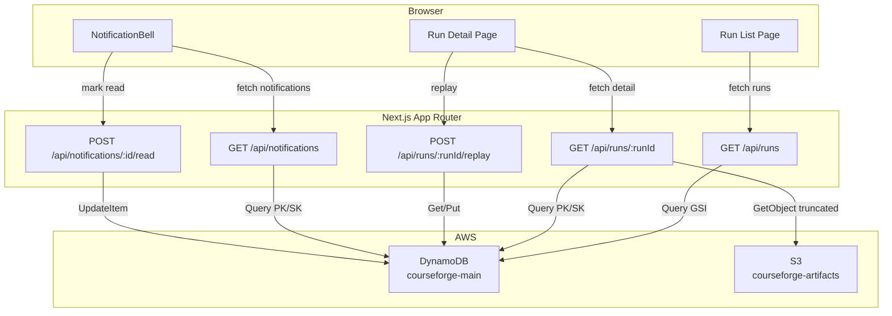
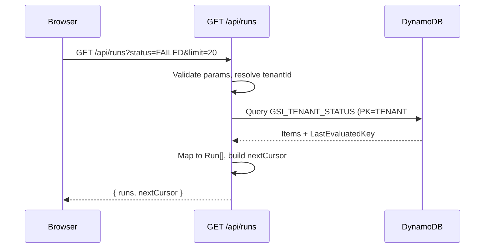
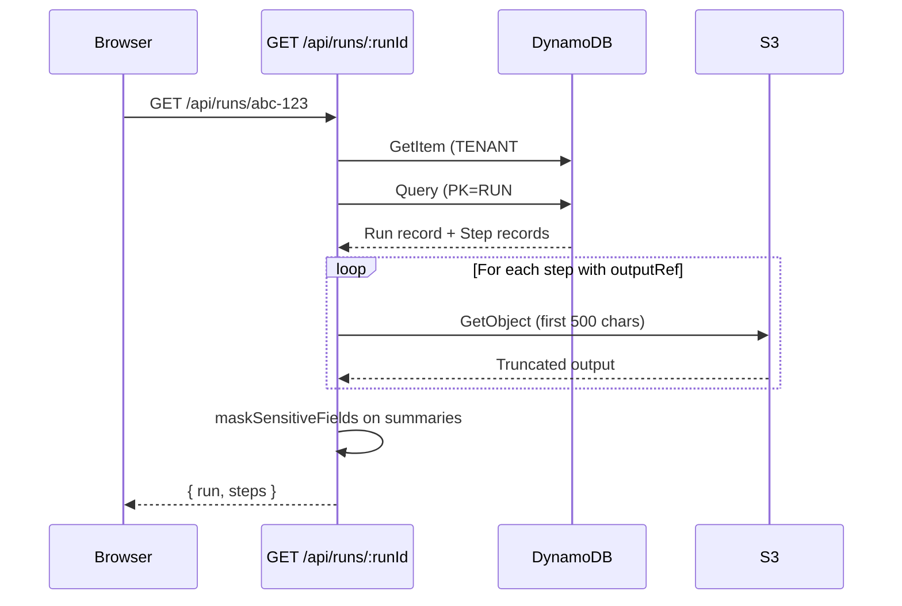

# Design Document — Run History & Observability UI

## Overview

Run History & Observability UI is the frontend and API layer that exposes the existing run orchestration backend to CourseForge Connect users. It provides Next.js App Router pages and API routes for browsing workflow runs, inspecting step-level execution detail, replaying failed runs, and receiving failure notifications — all without touching the AWS console.

The feature introduces four API route handlers (runs list, run detail, notifications list, notification mark-read), two pages (run list, run detail), a NotificationBell component, and a `maskSensitiveFields` utility. Two new GSIs (`GSI_WORKFLOW_RUNS`, `GSI_TENANT_STATUS`) are added to the existing `courseforge-main` DynamoDB table to support filtered queries. All API routes follow the established handler-factory pattern with dependency injection for testability.

### Design Decisions

1. **Cursor-based pagination over offset**: DynamoDB `ExclusiveStartKey` maps naturally to cursor-based pagination. Offset pagination would require scanning and discarding rows, which is wasteful on a pay-per-request table.
2. **Limit clamped to 100**: Prevents clients from requesting unbounded result sets that could cause DynamoDB throttling or large response payloads.
3. **S3 output truncation at 500 chars**: Step outputs stored in S3 can be arbitrarily large. Fetching only the first 500 characters for `outputSummary` keeps the detail API response lean while giving enough context for diagnosis.
4. **Masking utility as a pure function**: `maskSensitiveFields` is a recursive, side-effect-free function that produces a new object. This makes it trivially testable with property-based tests and safe to call in any context.
5. **Polling over WebSockets for auto-refresh**: The run list (30s) and run detail (5s) pages use polling intervals. WebSockets would add infrastructure complexity (API Gateway WebSocket API, connection management) for a feature where near-real-time is sufficient, not required.
6. **Static error code map**: Error code explanations are stored in a static TypeScript map rather than fetched from an API. This avoids an extra network call and keeps the tooltip instant. New codes are added via code changes.
7. **Tenant isolation via query-time filtering**: All API routes resolve `tenantId` from the request header and include it in every DynamoDB query key condition. Run detail additionally checks tenant ownership before returning data.

## Architecture



### Data Flow — Run List



### Data Flow — Run Detail with S3 Fetch



## Components and Interfaces

### 1. Type Definitions

**File**: `packages/types/src/events.ts` (additions)

```typescript
export interface Run {
  runId: string;
  workflowId: string;
  workflowName: string;
  tenantId: string;
  versionId: string;
  status: RunStatus;
  triggerType: 'webhook' | 'scheduled' | 'replay';
  triggerEventId: string;
  startedAt: string;
  endedAt?: string;
  durationMs?: number;
  parentRunId?: string;
  failedStepId?: string;
}

export interface RunStep {
  stepId: string;
  stepIndex: number;
  label: string;
  connectorKey: string;
  status: RunStatus;
  startedAt: string;
  endedAt?: string;
  inputSummary: string;
  outputSummary: string;
  errorMessage?: string;
  errorCode?: string;
  rawResponse?: string;
}

export interface Notification {
  notificationId: string;
  type: string;
  workflowId: string;
  workflowName: string;
  runId: string;
  failedStepName: string;
  read: boolean;
  createdAt: string;
}
```

### 2. Schema Additions

**File**: `src/models/schema.ts` (additions)

```typescript
export const KEY_PREFIX = {
  // ... existing prefixes
  STEP: 'STEP#',
  USER: 'USER#',
  NOTIFICATION: 'NOTIFICATION#',
} as const;

// New key builders
export function runPK(runId: string): string {
  return `${KEY_PREFIX.RUN}${runId}`;
}

export function stepSK(stepIndex: number, stepId: string): string {
  return `${KEY_PREFIX.STEP}${String(stepIndex).padStart(4, '0')}#${stepId}`;
}

export function userPK(userId: string): string {
  return `${KEY_PREFIX.USER}${userId}`;
}

export function notificationSK(timestamp: string, notificationId: string): string {
  return `${KEY_PREFIX.NOTIFICATION}${timestamp}#${notificationId}`;
}

// New GSI definitions
export const GSI_WORKFLOW_RUNS = 'GSI_WORKFLOW_RUNS';
export const GSI_TENANT_STATUS = 'GSI_TENANT_STATUS';
```

GSI key patterns:

| GSI Name | PK | SK | Use Case |
|----------|----|----|----------|
| `GSI_WORKFLOW_RUNS` | `WORKFLOW#{workflowId}` | `RUN#{timestamp}#{runId}` | List runs filtered by workflow |
| `GSI_TENANT_STATUS` | `TENANT#{tenantId}#STATUS#{status}` | `RUN#{timestamp}#{runId}` | List runs filtered by tenant + status |

### 3. Masking Utility

**File**: `src/lib/mask-sensitive.ts`

```typescript
const SENSITIVE_KEY_PATTERN = /password|token|secret|key|credential|auth/i;
const MASK_VALUE = '••••••••';

export function maskSensitiveFields(obj: unknown): unknown;
```

Logic:
1. If `obj` is `null`, `undefined`, or a primitive → return as-is
2. If `obj` is an array → return `obj.map(maskSensitiveFields)`
3. If `obj` is an object → for each key/value pair:
   - If key matches `SENSITIVE_KEY_PATTERN` → set value to `MASK_VALUE`
   - Else → recursively call `maskSensitiveFields(value)`
4. Always return a new object (never mutate input)

### 4. Runs API Handler

**File**: `src/api/runs/handler.ts`

```typescript
export interface RunsQueryParams {
  workflowId?: string;
  status?: string;
  dateFrom?: string;
  dateTo?: string;
  limit?: number;
  cursor?: string;
}

export interface RunsResponse {
  runs: Run[];
  nextCursor?: string;
}

export interface RunRepository {
  queryByTenant(tenantId: string, params: RunsQueryParams): Promise<{ items: Run[]; lastKey?: Record<string, unknown> }>;
  queryByWorkflow(workflowId: string, params: RunsQueryParams): Promise<{ items: Run[]; lastKey?: Record<string, unknown> }>;
  queryByTenantStatus(tenantId: string, status: string, params: RunsQueryParams): Promise<{ items: Run[]; lastKey?: Record<string, unknown> }>;
  getById(tenantId: string, runId: string): Promise<Run | null>;
  getSteps(runId: string): Promise<RunStep[]>;
}

export function createRunsHandler(repo: RunRepository);
```

Validation rules:
- `limit`: integer 1–100, default 50, clamped if > 100
- `status`: must be a valid `RunStatus` value
- `dateFrom`, `dateTo`: must be valid ISO 8601 strings
- `cursor`: base64-encoded `ExclusiveStartKey`
- Invalid params → 400 with descriptive message

Query routing:
- `workflowId` provided → query `GSI_WORKFLOW_RUNS`
- `status` provided → query `GSI_TENANT_STATUS`
- Neither → query main table with `PK=TENANT#{tenantId}`, `SK begins_with RUN#`

### 5. Run Detail API Handler

**File**: `src/api/runs/detail-handler.ts`

```typescript
export interface S3Client {
  getObjectTruncated(bucket: string, key: string, maxBytes: number): Promise<string>;
}

export interface RunDetailResponse {
  run: Run;
  steps: RunStep[];
}

export function createRunDetailHandler(repo: RunRepository, s3: S3Client);
```

Logic:
1. Extract `runId` from path parameters, `tenantId` from header
2. Fetch Run record → 404 if not found or tenant mismatch
3. Query RunStep records with `PK=RUN#{runId}`, `SK begins_with STEP#`
4. For each step with `outputRef` → fetch first 500 chars from S3
5. Apply `maskSensitiveFields` to `inputSummary` and `outputSummary`
6. Sort steps by `stepIndex` ascending
7. Return `{ run, steps }`

### 6. Notifications API Handler

**File**: `src/api/notifications/handler.ts`

```typescript
export interface NotificationRepository {
  queryByUser(userId: string, limit: number): Promise<Notification[]>;
  markRead(userId: string, notificationId: string, readAt: string): Promise<boolean>;
}

export interface NotificationsResponse {
  notifications: Notification[];
  unreadCount: number;
}

export function createNotificationsHandler(repo: NotificationRepository);
export function createNotificationReadHandler(repo: NotificationRepository);
```

GET `/api/notifications`:
1. Resolve `userId` from auth header
2. Query `PK=USER#{userId}`, `SK begins_with NOTIFICATION#`, limit 20, `ScanIndexForward=false` (newest first)
3. Partition into unread-first, then read
4. Return `{ notifications, unreadCount }`

POST `/api/notifications/:notificationId/read`:
1. Resolve `userId`, extract `notificationId`
2. Update item: set `read=true`, `readAt=now`
3. If item not found or wrong user → 404
4. Return 204

### 7. Run List Page

**File**: `src/ui/run-list.ts`

Pure TypeScript module for run list page state and view models.

```typescript
export interface RunListState {
  runs: Run[];
  filters: RunFilters;
  nextCursor?: string;
  isLoading: boolean;
  isPolling: boolean;
}

export interface RunFilters {
  workflowId?: string;
  statuses: RunStatus[];
  dateFrom?: string;
  dateTo?: string;
}

export function createRunListState(): RunListState;
export function applyFilters(state: RunListState, filters: RunFilters): RunListState;
export function appendPage(state: RunListState, runs: Run[], nextCursor?: string): RunListState;
export function sortFailedFirst(runs: Run[]): Run[];
export function shouldPoll(runs: Run[]): boolean;
export function buildEmptyStateMessage(): string;
```

`sortFailedFirst`: Sorts runs so that `FAILED` status appears first within any date grouping, preserving chronological order otherwise.

`shouldPoll`: Returns `true` if any run has status `RUNNING` or `PENDING`.

### 8. Run Detail Page

**File**: `src/ui/run-detail.ts`

```typescript
export interface RunDetailState {
  run: Run | null;
  steps: RunStep[];
  isLoading: boolean;
  isPolling: boolean;
}

export const ERROR_CODE_MAP: Record<string, string> = {
  CONNECTOR_TIMEOUT: 'The external service did not respond within the allowed time. This is usually transient — try replaying.',
  AUTH_EXPIRED: 'The connection credentials have expired. Rotate the credentials in the Connections page.',
  RATE_LIMITED: 'The external service rejected the request due to rate limiting. Wait a few minutes and replay.',
  SCHEMA_MISMATCH: 'The data returned by the external service did not match the expected format. Check the connector configuration.',
  // ... additional codes
};

export function createRunDetailState(): RunDetailState;
export function getErrorExplanation(errorCode: string): string;
export function isTerminalStatus(status: RunStatus): boolean;
export function shouldPollDetail(run: Run | null): boolean;
export function formatDuration(ms: number): string;
export function buildReplayBadgeText(parentRunId: string): string;
```

`getErrorExplanation`: Looks up `errorCode` in `ERROR_CODE_MAP`. Returns the explanation if found, otherwise returns `"This error code is not yet documented. Contact support if the issue persists."`.

`isTerminalStatus`: Returns `true` for `SUCCESS` or `FAILED`.

### 9. NotificationBell Component

**File**: `src/ui/notification-bell.ts`

```typescript
export interface NotificationBellState {
  notifications: Notification[];
  unreadCount: number;
  isOpen: boolean;
  isPolling: boolean;
}

export function createNotificationBellState(): NotificationBellState;
export function updateNotifications(state: NotificationBellState, notifications: Notification[], unreadCount: number): NotificationBellState;
export function markNotificationRead(state: NotificationBellState, notificationId: string): NotificationBellState;
export function markAllRead(state: NotificationBellState): NotificationBellState;
export function toggleDropdown(state: NotificationBellState): NotificationBellState;
export function getVisibleNotifications(state: NotificationBellState, limit?: number): Notification[];
export function shouldShowBadge(state: NotificationBellState): boolean;
export function formatRelativeTime(createdAt: string, now?: Date): string;
```

`formatRelativeTime`: Converts ISO timestamp to relative string (e.g., "2 min ago", "1 hr ago", "3 days ago").

`getVisibleNotifications`: Returns up to `limit` (default 5) notifications from state.

### 10. Status Badge Utility

**File**: `src/ui/status-badge.ts`

```typescript
export interface StatusBadgeViewModel {
  label: string;
  colorClass: string;
  animate: boolean;
}

export const STATUS_BADGE_MAP: Record<RunStatus, StatusBadgeViewModel> = {
  SUCCESS: { label: 'Success', colorClass: 'bg-green-100 text-green-800', animate: false },
  FAILED: { label: 'Failed', colorClass: 'bg-red-100 text-red-800', animate: false },
  RUNNING: { label: 'Running', colorClass: 'bg-amber-100 text-amber-800', animate: true },
  PENDING: { label: 'Pending', colorClass: 'bg-gray-100 text-gray-800', animate: false },
  REPLAYING: { label: 'Replaying', colorClass: 'bg-blue-100 text-blue-800', animate: false },
};

export function getStatusBadge(status: RunStatus): StatusBadgeViewModel;
```

### 11. Query Parameter Validation

**File**: `src/api/runs/validation.ts`

```typescript
export interface ValidationResult {
  valid: boolean;
  errors: string[];
  parsed: RunsQueryParams;
}

export function validateRunsQueryParams(raw: Record<string, string | undefined>): ValidationResult;
export function isValidISODate(value: string): boolean;
export function clampLimit(value: number, max?: number): number;
export function encodeCursor(lastKey: Record<string, unknown>): string;
export function decodeCursor(cursor: string): Record<string, unknown> | null;
```

`clampLimit`: Returns `Math.min(Math.max(1, value), max ?? 100)`.

`encodeCursor` / `decodeCursor`: Base64 encode/decode of `JSON.stringify(lastKey)`. `decodeCursor` returns `null` on invalid input.

## Data Models

All records live in the existing `courseforge-main` single-table. The Run_Record and RunStep_Record schemas are defined in the run-orchestration design. This feature adds two GSIs and references the existing Notification_Record.

### GSI_WORKFLOW_RUNS

Enables "list runs for a specific workflow" access pattern.

| Attribute | Source |
|-----------|--------|
| GSI PK | `WORKFLOW#{workflowId}` (projected from Run_Record `workflowId` field) |
| GSI SK | `RUN#{timestamp}#{runId}` (same as main table SK) |
| Projection | ALL |

### GSI_TENANT_STATUS

Enables "list runs for a tenant filtered by status" access pattern.

| Attribute | Source |
|-----------|--------|
| GSI PK | `TENANT#{tenantId}#STATUS#{status}` (composite of tenant + status) |
| GSI SK | `RUN#{timestamp}#{runId}` (same as main table SK) |
| Projection | ALL |

### Cursor Encoding

The `nextCursor` returned by the Runs API is a base64-encoded JSON string of the DynamoDB `LastEvaluatedKey`. The client passes it back as the `cursor` query parameter, which the API decodes into `ExclusiveStartKey`.

```typescript
// Encode
const nextCursor = Buffer.from(JSON.stringify(lastEvaluatedKey)).toString('base64');

// Decode
const exclusiveStartKey = JSON.parse(Buffer.from(cursor, 'base64').toString('utf-8'));
```

### Notification_Record (reference)

Already defined in run-orchestration design. Key pattern:
- PK: `USER#{userId}`
- SK: `NOTIFICATION#{timestamp}#{notificationId}`

This feature adds a `readAt` field (ISO 8601 string, set when marked as read).

