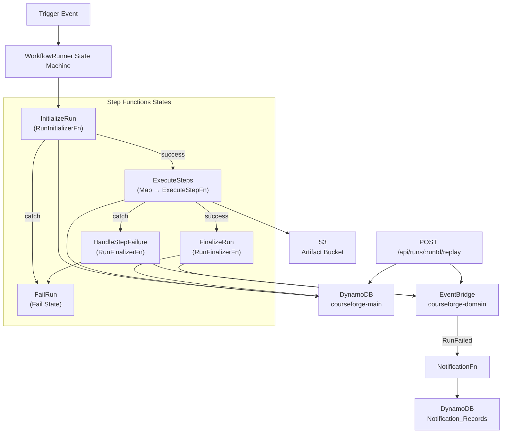
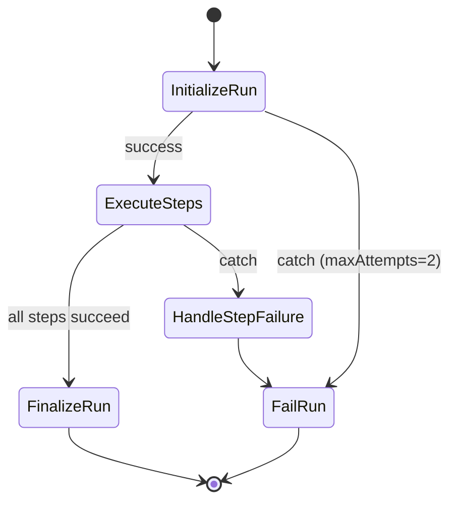

# Design Document — Run Orchestration

## Overview

Run Orchestration is the execution engine for CourseForge Connect. It takes a trigger event, resolves the published workflow version, and executes each step sequentially through a Step Functions Standard Workflow. The design centers on four Lambda functions coordinated by a `WorkflowRunner` state machine, with an EventBridge rule for failure notification routing and a replay API for re-running failed executions.

The system uses the existing `courseforge-main` DynamoDB table (single-table design) for Run, RunStep, Audit, and Notification records, and the existing `courseforge-artifacts-{account}-{region}` S3 bucket for large step output offloading. All components emit X-Ray traces and CloudWatch metrics.

### Design Decisions

1. **Standard Workflow over Express**: Standard Workflows support execution durations up to 1 year and provide built-in execution history, which is essential for audit and replay. The 1-hour timeout is a reasonable upper bound for educational workflow runs.
2. **Map state with MaxConcurrency=1**: Steps execute sequentially because each step's output feeds into the next step's `accumulatedContext`. This preserves the imperative execution model users expect from a workflow builder.
3. **4 KB offloading threshold**: DynamoDB items have a 400 KB limit, but keeping step records lean improves scan/query performance. 4 KB is a practical threshold that keeps most outputs inline while offloading anything substantial to S3.
4. **Connector Registry pattern**: Reuses the existing connector abstraction from the Recipe Library. Each connector exposes a `run(params, context)` method, making step execution uniform regardless of the underlying integration.
5. **Replay via new Run**: Rather than mutating the failed run, replay creates a fresh Run_Record with `parentRunId` linking back. This preserves the audit trail of the original failure.

## Architecture



### State Machine Flow



## Components and Interfaces

### 1. OrchestrationStack (CDK)

**File**: `infra/lib/orchestration-stack.ts`

Provisions all run orchestration resources. Imports foundation stack outputs (Main_Table, Artifact_Bucket, Domain_Event_Bus) via `Fn.importValue` or cross-stack references.

```typescript
interface OrchestrationStackProps extends cdk.StackProps {
  mainTable: dynamodb.ITable;
  artifactBucket: s3.IBucket;
  eventBus: events.IEventBus;
}
```

Resources provisioned:
- `WorkflowRunner` Step Functions Standard Workflow with X-Ray tracing, 1-hour timeout
- `RunInitializerFn` Lambda (Node.js 20, 256 MB, 30s timeout)
- `ExecuteStepFn` Lambda (Node.js 20, 512 MB, 5min timeout)
- `RunFinalizerFn` Lambda (Node.js 20, 256 MB, 30s timeout)
- `NotificationFn` Lambda (Node.js 20, 256 MB, 30s timeout)
- EventBridge rule matching `source: courseforge.run, detail-type: RunFailed` → NotificationFn
- IAM roles with least-privilege policies
- CloudFormation output: WorkflowRunner state machine ARN

### 2. RunInitializerFn

**File**: `functions/run-initializer/handler.ts`

```typescript
interface RunInitializerInput {
  tenantId: string;
  workflowId: string;
  runId: string;
  traceId: string;
  payload: Record<string, unknown>;
}

interface RunInitializerOutput {
  steps: StepDefinition[];
  workflowId: string;
  runId: string;
  tenantId: string;
  traceId: string;
  payload: Record<string, unknown>;
}

interface StepDefinition {
  stepId: string;
  stepIndex: number;
  connectorKey: string;
  actionType: string;
  params: Record<string, unknown>;
  retryPolicy: { maxAttempts: number; backoffRate: number };
}
```

Logic:
1. Fetch workflow record from Main_Table: `PK=WORKFLOW#{workflowId}`, `SK=VERSION#{versionId}`
2. Throw `workflow not found` if record missing
3. Throw `no published version` if no published version exists
4. Deserialize `compiledPlan` → `StepDefinition[]`
5. Update Run_Record: `status=RUNNING`, `versionId`, `startedAt`
6. Return `RunInitializerOutput`

### 3. ExecuteStepFn

**File**: `functions/execute-step/handler.ts`

```typescript
interface ExecuteStepInput {
  step: StepDefinition;
  runId: string;
  tenantId: string;
  traceId: string;
  accumulatedContext: Record<string, unknown>;
}

interface ExecuteStepOutput {
  accumulatedContext: Record<string, unknown>;
}
```

Logic:
1. Write RunStep_Record: `PK=RUN#{runId}`, `SK=STEP#{stepIndex}#{stepId}`, `status=RUNNING`
2. Resolve connector from Connector_Registry via `step.connectorKey`
3. Invoke `connector.run(step.params, accumulatedContext)`
4. On success:
   - If output ≤ 4 KB → store inline in `output` field
   - If output > 4 KB → write to S3 at `runs/{runId}/steps/{stepId}/output.json`, store `outputRef`
   - Update RunStep_Record: `status=SUCCESS`, `endedAt`
   - Return merged context: `{ ...accumulatedContext, [step.stepId]: result }`
5. On failure:
   - Update RunStep_Record: `status=FAILED`, `endedAt`, `error: { message, code, rawResponse }`
   - Throw error → Map state catch → HandleStepFailure
6. Emit X-Ray subsegment per connector call
7. Emit CloudWatch metrics: `courseforge/StepExecutionDuration`, `courseforge/StepSuccess`

### 4. RunFinalizerFn

**File**: `functions/run-finalizer/handler.ts`

```typescript
interface RunFinalizerInput {
  runId: string;
  tenantId: string;
  workflowId: string;
  status: 'SUCCESS' | 'FAILED';
  error?: { failedStepId: string; errorMessage: string; errorCode: string };
  stepResults?: Record<string, unknown>[];
}

interface RunFinalizerOutput {
  runId: string;
  status: 'SUCCESS' | 'FAILED';
}
```

Logic:
1. Update Run_Record: `status`, `endedAt`, `durationMs`
2. If `FAILED`: store `failedStepId`, `errorMessage`, `errorCode` in Run_Record
3. Write Audit_Entry: `PK=TENANT#{tenantId}`, `SK=AUDIT#{timestamp}#{runId}`, `actionType=RUN_COMPLETED|RUN_FAILED`
4. Publish domain event to `courseforge-domain` bus:
   - `source: courseforge.run`
   - `detail-type: RunCompleted | RunFailed`
   - `detail: { tenantId, workflowId, runId, status, durationMs }`
5. Return `{ runId, status }`

### 5. NotificationFn

**File**: `functions/notification/handler.ts`

```typescript
interface RunFailedEvent {
  tenantId: string;
  workflowId: string;
  runId: string;
  status: 'FAILED';
  durationMs: number;
}
```

Logic:
1. Receive `RunFailed` event from EventBridge
2. Query Main_Table for users: `PK=TENANT#{tenantId}`, `SK begins_with USER#`, filter by notification preferences
3. Batch write Notification_Records: `PK=USER#{userId}`, `SK=NOTIFICATION#{timestamp}#{notificationId}`
4. Each record: `type=RUN_FAILED`, `workflowId`, `runId`, `workflowName`, `failedStepName`, `read=false`, `createdAt`

### 6. Replay API

**File**: `src/api/replay/handler.ts`

```typescript
// POST /api/runs/:runId/replay
interface ReplayResponse {
  newRunId: string;
  parentRunId: string;
}
```

Logic:
1. Fetch Run_Record from Main_Table
2. If `status !== FAILED` → return 422
3. Create new Run_Record: `status=PENDING`, `triggerType=replay`, `parentRunId=original runId`
4. Publish event: `source=courseforge.trigger`, `detail-type=RunReplayed`, original trigger payload
5. Return `{ newRunId, parentRunId }`

## Data Models

All records live in the existing `courseforge-main` single-table. Key patterns follow the established `PK/SK` convention.

### Run_Record

| Field | Type | Description |
|-------|------|-------------|
| PK | `TENANT#{tenantId}` | Partition key |
| SK | `RUN#{timestamp}#{runId}` | Sort key (timestamp-prefixed for chronological queries) |
| runId | string | UUID |
| workflowId | string | Reference to the workflow |
| versionId | string | Resolved published version |
| status | `PENDING \| RUNNING \| SUCCESS \| FAILED` | Current run status |
| triggerType | `manual \| scheduled \| replay` | How the run was initiated |
| parentRunId | string \| null | Set when `triggerType=replay` |
| payload | Record | Original trigger payload |
| startedAt | string (ISO 8601) | Set by RunInitializerFn |
| endedAt | string (ISO 8601) | Set by RunFinalizerFn |
| durationMs | number | Computed by RunFinalizerFn |
| failedStepId | string \| null | Set on failure |
| errorMessage | string \| null | Set on failure |
| errorCode | string \| null | Set on failure |
| tenantId | string | GSI attribute |
| workflowId | string | GSI attribute |

### RunStep_Record

| Field | Type | Description |
|-------|------|-------------|
| PK | `RUN#{runId}` | Partition key |
| SK | `STEP#{stepIndex}#{stepId}` | Sort key |
| stepId | string | Step identifier |
| stepIndex | number | Execution order |
| connectorKey | string | Connector used |
| status | `RUNNING \| SUCCESS \| FAILED` | Step status |
| startedAt | string (ISO 8601) | |
| endedAt | string (ISO 8601) | |
| output | Record \| null | Inline output (≤ 4 KB) |
| outputRef | string \| null | S3 key for large outputs |
| error | `{ message, code, rawResponse }` \| null | Set on failure |

### Audit_Entry

| Field | Type | Description |
|-------|------|-------------|
| PK | `TENANT#{tenantId}` | Partition key |
| SK | `AUDIT#{timestamp}#{runId}` | Sort key |
| actionType | `RUN_COMPLETED \| RUN_FAILED` | |
| runId | string | |
| workflowId | string | |
| status | string | |
| durationMs | number | |
| createdAt | string (ISO 8601) | |

### Notification_Record

| Field | Type | Description |
|-------|------|-------------|
| PK | `USER#{userId}` | Partition key |
| SK | `NOTIFICATION#{timestamp}#{notificationId}` | Sort key |
| type | `RUN_FAILED` | Notification type |
| workflowId | string | |
| runId | string | |
| workflowName | string | |
| failedStepName | string | |
| read | boolean | Default `false` |
| createdAt | string (ISO 8601) | |

### Domain Event Structure (EventBridge)

```typescript
interface RunDomainEvent {
  source: 'courseforge.run' | 'courseforge.trigger';
  'detail-type': 'RunCompleted' | 'RunFailed' | 'RunReplayed';
  detail: {
    tenantId: string;
    workflowId: string;
    runId: string;
    status: 'SUCCESS' | 'FAILED';
    durationMs: number;
  };
}
```


## Correctness Properties

*A property is a characteristic or behavior that should hold true across all valid executions of a system — essentially, a formal statement about what the system should do. Properties serve as the bridge between human-readable specifications and machine-verifiable correctness guarantees.*

### Property 1: StepDefinition deserialization round-trip

*For any* valid array of StepDefinition objects, serializing to JSON and deserializing back should produce an equivalent array of StepDefinition objects.

**Validates: Requirements 2.2**

### Property 2: Connector registry resolution consistency

*For any* connectorKey that exists in the Connector_Registry, resolving it should return a connector object with a callable `run` method. *For any* connectorKey that does not exist in the registry, resolution should throw an error.

**Validates: Requirements 3.2**

### Property 3: Output offloading threshold decision

*For any* step output, if `JSON.stringify(output).length > 4096` then the output should be written to S3 at key `runs/{runId}/steps/{stepId}/output.json` and the RunStep_Record should have `outputRef` set and `output` set to null. If `JSON.stringify(output).length <= 4096` then the output should be stored inline in the RunStep_Record `output` field and `outputRef` should be null.

**Validates: Requirements 3.4, 3.5, 8.1, 8.2, 8.3**

### Property 4: Context accumulation preserves existing keys

*For any* accumulated context object and any step result, the merged context returned by ExecuteStepFn should contain all keys from the original accumulated context plus the new step's result keyed by `step.stepId`.

**Validates: Requirements 3.6**

### Property 5: Run finalization persists correct status and timing

*For any* run finalization input with status `SUCCESS` or `FAILED`, the updated Run_Record should have `status` matching the input, `endedAt` set to a valid ISO 8601 timestamp, and `durationMs` equal to the difference between `endedAt` and `startedAt` in milliseconds.

**Validates: Requirements 4.1**

### Property 6: Audit entry actionType matches run status

*For any* run finalization, the written Audit_Entry `actionType` should be `RUN_COMPLETED` when status is `SUCCESS` and `RUN_FAILED` when status is `FAILED`.

**Validates: Requirements 4.3**

### Property 7: Domain event structure and status mapping

*For any* domain event published by the RunFinalizerFn, the event should contain `tenantId`, `workflowId`, `runId`, `status`, and `durationMs` fields, with `source` set to `courseforge.run` and `detail-type` set to `RunCompleted` when status is `SUCCESS` or `RunFailed` when status is `FAILED`.

**Validates: Requirements 4.4, 10.1, 10.3**

### Property 8: Replay rejects non-FAILED runs

*For any* Run_Record with status in `{PENDING, RUNNING, SUCCESS}`, a POST to `/api/runs/:runId/replay` should return a 422 Unprocessable Entity response.

**Validates: Requirements 5.2**

### Property 9: Notification count matches subscribed users

*For any* set of tenant users with varying notification preferences and a RunFailed event, the number of Notification_Records written should equal the number of users who have notifications enabled for the failed workflow's `workflowId` or for `all` workflows.

**Validates: Requirements 7.2**

### Property 10: Domain event serialization round-trip

*For any* valid domain event object published by the RunFinalizerFn, `JSON.parse(JSON.stringify(event))` should produce an object deeply equal to the original event.

**Validates: Requirements 10.2**

## Error Handling

### RunInitializerFn Errors

| Error Condition | Behavior | Downstream Effect |
|----------------|----------|-------------------|
| Workflow not found in Main_Table | Throw error with `workflow not found` | Step Functions retry (2 attempts), then catch → FailRun |
| No published version | Throw error with `no published version` | Step Functions retry (2 attempts), then catch → FailRun |
| DynamoDB throttle/transient error | Throw error (unhandled) | Step Functions retry (2 attempts, 1s interval) |

### ExecuteStepFn Errors

| Error Condition | Behavior | Downstream Effect |
|----------------|----------|-------------------|
| Connector not found in registry | Throw error | Map state catch → HandleStepFailure |
| Connector `run()` throws | Update RunStep_Record with `FAILED` status and error details, then re-throw | Map state catch → HandleStepFailure |
| S3 write failure (offloading) | Throw error | Map state catch → HandleStepFailure |
| DynamoDB write failure | Throw error | Map state catch → HandleStepFailure |

### RunFinalizerFn Errors

| Error Condition | Behavior | Downstream Effect |
|----------------|----------|-------------------|
| DynamoDB update failure | Throw error (Step Functions will record execution failure) | Execution marked as failed in Step Functions console |
| EventBridge publish failure | Log error, throw | Execution marked as failed; notification not sent |

### Replay API Errors

| Error Condition | Behavior |
|----------------|----------|
| Run_Record not found | Return 404 |
| Run status is not FAILED | Return 422 Unprocessable Entity |
| DynamoDB/EventBridge failure | Return 500 Internal Server Error |

### NotificationFn Errors

| Error Condition | Behavior |
|----------------|----------|
| No subscribed users found | No-op, return successfully |
| DynamoDB batch write partial failure | Log failed items, do not retry (notifications are best-effort) |

## Testing Strategy

### Unit Tests

Unit tests verify specific examples, edge cases, and error conditions using Vitest with mocked dependencies.

**RunInitializerFn unit tests:**
- Throws `workflow not found` when workflow record is missing
- Throws `no published version` when version is absent
- Returns correct output shape for valid input
- Updates Run_Record status to `RUNNING`

**ExecuteStepFn unit tests:**
- Stores output inline when ≤ 4 KB (specific example)
- Offloads output to S3 when > 4 KB (specific example)
- Updates RunStep_Record to `FAILED` with error details on connector failure
- Throws error after recording failure (propagation to Map catch)

**RunFinalizerFn unit tests:**
- Writes audit entry with `RUN_COMPLETED` for success
- Writes audit entry with `RUN_FAILED` for failure
- Stores error details in Run_Record when status is FAILED
- Publishes domain event with correct source and detail-type

**Replay API unit tests:**
- Returns 422 for non-FAILED run statuses (PENDING, RUNNING, SUCCESS)
- Creates new Run_Record with `triggerType=replay` and `parentRunId`
- Publishes `RunReplayed` event with original trigger payload

**NotificationFn unit tests:**
- Writes one Notification_Record per subscribed user
- Skips users without notification preferences enabled
- Uses batch write operations

**OrchestrationStack CDK tests:**
- State machine named `courseforge-workflow-runner` with X-Ray tracing
- All 5 states present in state machine definition
- EventBridge rule matches `courseforge.run` / `RunFailed`
- NotificationFn is the rule target
- State machine ARN exported as CloudFormation output

### Property-Based Tests

Property-based tests use `fast-check` (already a project dependency) with Vitest. Each test runs a minimum of 100 iterations and references its design document property.

**Configuration:**
- Library: `fast-check` v3.x
- Framework: Vitest
- Minimum iterations: 100 per property (`{ numRuns: 100 }`)
- Tag format: `Feature: run-orchestration, Property {N}: {title}`

**Property tests to implement:**

1. **Feature: run-orchestration, Property 1: StepDefinition deserialization round-trip** — Generate arbitrary StepDefinition arrays, serialize to JSON, deserialize, assert deep equality.

2. **Feature: run-orchestration, Property 2: Connector registry resolution consistency** — Generate arbitrary connector keys (both valid and invalid), assert resolution succeeds for known keys and throws for unknown keys.

3. **Feature: run-orchestration, Property 3: Output offloading threshold decision** — Generate arbitrary JSON-serializable outputs of varying sizes, assert the offloading decision (inline vs S3) is correct based on the 4 KB threshold.

4. **Feature: run-orchestration, Property 4: Context accumulation preserves existing keys** — Generate arbitrary context objects and step results, assert merged context contains all original keys plus the new step key.

5. **Feature: run-orchestration, Property 5: Run finalization persists correct status and timing** — Generate arbitrary finalization inputs with valid timestamps, assert Run_Record fields are set correctly.

6. **Feature: run-orchestration, Property 6: Audit entry actionType matches run status** — Generate arbitrary status values (SUCCESS/FAILED), assert actionType mapping is correct.

7. **Feature: run-orchestration, Property 7: Domain event structure and status mapping** — Generate arbitrary finalization inputs, assert published event has all required fields and correct source/detail-type.

8. **Feature: run-orchestration, Property 8: Replay rejects non-FAILED runs** — Generate Run_Records with status in {PENDING, RUNNING, SUCCESS}, assert replay returns 422.

9. **Feature: run-orchestration, Property 9: Notification count matches subscribed users** — Generate arbitrary user sets with varying notification preferences, assert notification count equals subscribed count.

10. **Feature: run-orchestration, Property 10: Domain event serialization round-trip** — Generate arbitrary domain event objects with JSON-safe values, assert `JSON.parse(JSON.stringify(event))` deeply equals the original.

### Integration Tests

**RunInitializerFn integration tests** (Requirement 9):
- Framework: Vitest + DynamoDB local mock
- Test file: `functions/run-initializer/handler.integration.test.ts`
- Scenarios:
  - Non-existent workflow → error containing `workflow not found`
  - Workflow without published version → error containing `no published version`
  - Valid published workflow → returns step definitions, Run_Record status=RUNNING, startedAt set
