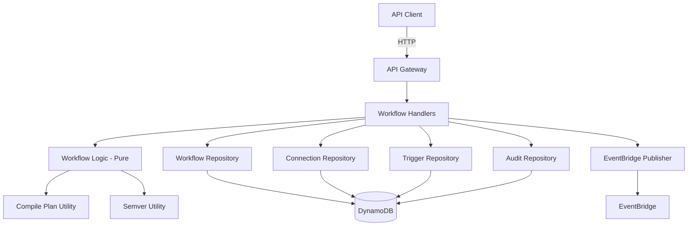
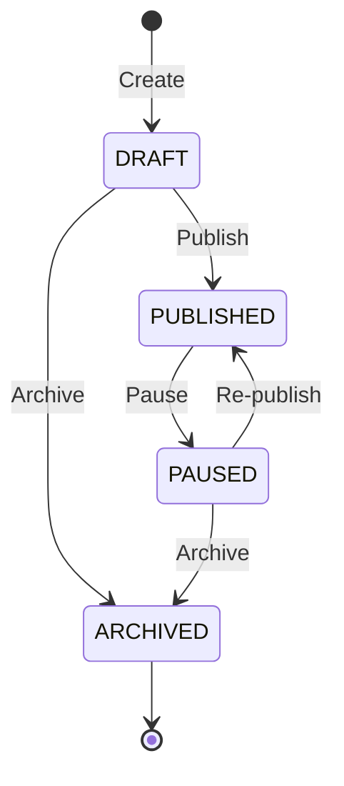

# Design Document: Workflow Management API

## Overview

The Workflow Management API provides the complete backend for managing workflow lifecycles in CourseForge Connect. It enables tenants to create workflows from recipes, version them with semver, publish/pause/archive them through a strict state machine, and query version history. The API is built on top of DynamoDB single-table design, uses EventBridge for domain events, and follows the existing handler/logic/repository separation pattern established by the Templates and Connections APIs.

The implementation extends the existing `src/api/workflows/handlers.ts` which already contains stub implementations for all seven API handlers. The design focuses on the pure logic layer (validation, filtering, state transitions, compilation) that can be property-tested, while the handlers orchestrate repository calls and side effects.

### Key Design Decisions

1. **Extend existing handler stubs** rather than creating new files — the handler factory pattern (`createXxxHandler`) is already in place.
2. **Extract pure logic into `src/api/workflows/logic.ts`** following the templates/connections pattern, enabling property-based testing of state transitions, filtering, and validation.
3. **Reuse existing utilities** — `packages/utils/src/compile-plan.ts` for recipe compilation and `packages/utils/src/semver.ts` for version management are already implemented and tested.
4. **Single-table DynamoDB** — workflow and version records use the key schema already defined in `src/models/schema.ts`.

## Architecture



### Request Flow

1. API Gateway routes request to the appropriate handler factory function
2. Handler extracts tenantId from `x-tenant-id` header (or body fallback), path params, query params, and body
3. Handler delegates validation and pure logic to `logic.ts` functions
4. Handler calls repository interfaces for DynamoDB operations
5. For publish/pause/archive, handler writes audit entries and publishes EventBridge events
6. Handler returns JSON response with appropriate HTTP status code

## Components and Interfaces

### Handlers (`src/api/workflows/handlers.ts`)

Already implemented handler factories. Each returns an async function `(event: APIGatewayProxyEvent) => Promise<APIGatewayProxyResult>`:

| Handler | Route | Method |
|---------|-------|--------|
| `createCreateWorkflowHandler` | `/api/workflows` | POST |
| `createListWorkflowsHandler` | `/api/workflows` | GET |
| `createGetWorkflowHandler` | `/api/workflows/:workflowId` | GET |
| `createPublishWorkflowHandler` | `/api/workflows/:workflowId/publish` | POST |
| `createPauseWorkflowHandler` | `/api/workflows/:workflowId/pause` | POST |
| `createArchiveWorkflowHandler` | `/api/workflows/:workflowId/archive` | POST |
| `createListWorkflowVersionsHandler` | `/api/workflows/:workflowId/versions` | GET |

### Pure Logic (`src/api/workflows/logic.ts` — new file)

Extracted pure functions for property-based testing:

| Function | Purpose |
|----------|---------|
| `filterWorkflows(workflows, statusFilter?, envFilter?)` | Filters workflow list by status and/or environmentId |
| `isValidTransition(from: WorkflowStatus, to: WorkflowStatus)` | Returns boolean for state machine validity |
| `getTransitionError(from: WorkflowStatus, to: WorkflowStatus)` | Returns descriptive error message for invalid transitions |
| `summarizeSteps(compiledPlan: StepDefinition[])` | Extracts step names from compiled plan, excluding secretRef |
| `sortVersionsDescending(versions: WorkflowVersionRecord[])` | Sorts versions by semver descending |
| `toVersionMetadata(version: WorkflowVersionRecord)` | Strips compiledPlan and paramSnapshot from version record |
| `validateCreateRequest(body: unknown)` | Validates create workflow request body fields |

### Repository Interfaces

Already defined in `handlers.ts`:

```typescript
interface WorkflowRepository {
  createWorkflow(workflow: WorkflowRecord): Promise<void>;
  updateWorkflow(workflow: WorkflowRecord): Promise<void>;
  getWorkflow(tenantId: string, workflowId: string): Promise<WorkflowRecord | null>;
  listWorkflows(tenantId: string): Promise<WorkflowRecord[]>;
  createVersion(version: WorkflowVersionRecord): Promise<void>;
  getVersion(workflowId: string, semver: string): Promise<WorkflowVersionRecord | null>;
  listVersions(workflowId: string): Promise<WorkflowVersionRecord[]>;
}

interface ConnectionRepository {
  listByIds(tenantId: string, connectionIds: string[]): Promise<Connection[]>;
}

interface TriggerRepository {
  hasWebhookSecret(tenantId: string, workflowId: string): Promise<boolean>;
  hasEnabledSchedule(workflowId: string): Promise<boolean>;
  disableSchedules(workflowId: string): Promise<void>;
}

interface AuditRepository {
  write(entry: AuditEntry): Promise<void>;
}

interface EventBridgePublisher {
  putEvent(input: EventInput): Promise<void>;
}
```

### Existing Utilities

- **`compilePlan(recipe, params, connections)`** — Already implemented in `packages/utils/src/compile-plan.ts`. Merges recipe steps with user params, resolves `{{ }}` templates and `connectionKey` references. Throws `CompilationError` on missing params or connections.
- **`bumpMinor(version)`**, **`bumpPatch(version)`**, **`compareSemver(a, b)`** — Already implemented in `packages/utils/src/semver.ts`.

## Data Models

### WorkflowRecord (DynamoDB)

```
PK: TENANT#{tenantId}
SK: WORKFLOW#{workflowId}
```

| Field | Type | Description |
|-------|------|-------------|
| workflowId | string (UUID) | Unique workflow identifier |
| tenantId | string | Owning tenant |
| name | string | User-provided workflow name |
| description | string | Optional description |
| recipeId | string | Source recipe identifier |
| status | WorkflowStatus | DRAFT / PUBLISHED / PAUSED / ARCHIVED |
| currentVersionId | string (UUID) | Points to the active version |
| createdAt | string (ISO 8601) | Creation timestamp |
| updatedAt | string (ISO 8601) | Last modification timestamp |
| createdBy | string | Actor who created the workflow |
| connectionIds | string[] | Referenced connection IDs |
| environmentId | 'dev' \| 'prod' | Deployment environment |

### WorkflowVersionRecord (DynamoDB)

```
PK: WORKFLOW#{workflowId}
SK: VERSION#{semver}
```

| Field | Type | Description |
|-------|------|-------------|
| versionId | string (UUID) | Unique version identifier |
| workflowId | string | Parent workflow |
| semver | string | Semantic version (e.g., "0.1.0") |
| compiledPlan | StepDefinition[] | Compiled execution plan |
| createdBy | string | Actor who created the version |
| createdAt | string (ISO 8601) | Version creation timestamp |
| recipeId | string | Recipe used for compilation |
| paramSnapshot | Record<string, unknown> | Frozen wizard params |

### Workflow Lifecycle State Machine



Valid transitions:
- DRAFT → PUBLISHED (publish)
- DRAFT → ARCHIVED (archive)
- PUBLISHED → PAUSED (pause)
- PAUSED → PUBLISHED (re-publish)
- PAUSED → ARCHIVED (archive)

ARCHIVED is a terminal state — no transitions out.


## Correctness Properties

*A property is a characteristic or behavior that should hold true across all valid executions of a system — essentially, a formal statement about what the system should do. Properties serve as the bridge between human-readable specifications and machine-verifiable correctness guarantees.*

### Property 1: Create Workflow Request Validation

*For any* JSON request body, the create workflow validator SHALL accept the body if and only if it is a JSON object containing a non-empty string `name`, a non-empty string `recipeId`, an `environmentId` of either `"dev"` or `"prod"`, and a `connectionIds` array of strings; and the tenantId SHALL be resolved from the `x-tenant-id` header first, falling back to the body `tenantId` field, returning an error when both are missing or empty.

**Validates: Requirements 1.1, 1.2, 1.3, 1.4, 1.5**

### Property 2: Connection Status Validation

*For any* set of connection records with mixed statuses and a set of requested connectionIds, the connection validator SHALL accept the set if and only if every requested connectionId exists in the set and has status equal to `"active"`.

**Validates: Requirements 1.8, 1.9, 4.6, 4.7**

### Property 3: Workflow List Filtering

*For any* array of workflow records and any optional status filter and optional environmentId filter, the filtered result SHALL contain exactly the workflows that match both filters (when provided), and all workflows when no filters are provided.

**Validates: Requirements 2.4, 2.5, 2.6**

### Property 4: Step Summary Correctness

*For any* array of StepDefinition objects (including those with `secretRef` values in their params), `summarizeSteps` SHALL return an array containing exactly the `name` field of each step in order, and the returned array SHALL contain no `secretRef` values.

**Validates: Requirements 3.5, 3.6**

### Property 5: Version Sorting by Semver Descending

*For any* array of WorkflowVersionRecord objects with valid semver strings, `sortVersionsDescending` SHALL return the versions ordered such that for every adjacent pair (a, b), `compareSemver(a.semver, b.semver)` >= 0.

**Validates: Requirements 7.4**

### Property 6: Version Metadata Projection

*For any* WorkflowVersionRecord, `toVersionMetadata` SHALL return an object containing versionId, workflowId, semver, createdBy, createdAt, and recipeId, and SHALL NOT contain compiledPlan or paramSnapshot fields.

**Validates: Requirements 7.5**

### Property 7: Semver Round-Trip

*For any* tuple of three non-negative integers (major, minor, patch), formatting as `"major.minor.patch"` then parsing SHALL produce the original tuple.

**Validates: Requirements 8.1, 8.6**

### Property 8: Semver Comparison Total Order

*For any* valid semver strings a, b, and c: (1) `compareSemver(a, a)` SHALL return 0 (reflexive), (2) `compareSemver(a, b)` SHALL equal `-compareSemver(b, a)` (antisymmetric), and (3) if `compareSemver(a, b) <= 0` and `compareSemver(b, c) <= 0` then `compareSemver(a, c) <= 0` (transitive).

**Validates: Requirements 8.5, 8.7, 8.8**

### Property 9: bumpMinor Correctness

*For any* valid semver string `"major.minor.patch"`, `bumpMinor` SHALL return `"major.(minor+1).0"` and `compareSemver(bumpMinor(v), v)` SHALL return 1.

**Validates: Requirements 8.3, 8.9**

### Property 10: bumpPatch Correctness

*For any* valid semver string `"major.minor.patch"`, `bumpPatch` SHALL return `"major.minor.(patch+1)"` and `compareSemver(bumpPatch(v), v)` SHALL return 1.

**Validates: Requirements 8.4, 8.10**

### Property 11: Invalid Semver Rejection

*For any* string that does not match the pattern `digits.digits.digits`, `parseSemver` SHALL throw an Error.

**Validates: Requirements 8.2**

### Property 12: Compilation Size Invariant

*For any* valid recipe, params, and connections inputs, the length of the `compilePlan` output array SHALL equal the number of steps in the input recipe.

**Validates: Requirements 9.1, 9.8**

### Property 13: Compilation Completeness

*For any* valid recipe, params, and connections inputs, every string value at every depth in the compiled StepDefinition output SHALL contain no unresolved `{{ }}` template placeholders.

**Validates: Requirements 9.2, 9.4, 9.9**

### Property 14: Compilation ConnectionKey Resolution

*For any* recipe step containing a `connectionKey` reference and a connections array containing that key, the compiled output SHALL include the corresponding `secretRef` value from the matching connection.

**Validates: Requirements 9.3**

### Property 15: Compilation Rejects Missing Required Params

*For any* recipe with a non-empty `requiredParams` array and a params record missing at least one required key, `compilePlan` SHALL throw a `CompilationError` whose `field` property matches the missing param name.

**Validates: Requirements 9.5**

### Property 16: Compilation Rejects Unresolvable References

*For any* recipe step containing a `{{ key }}` template where `key` is not in the params record, or a `connectionKey` not in the connections array, `compilePlan` SHALL throw a `CompilationError`.

**Validates: Requirements 9.6, 9.7**

### Property 17: Workflow Lifecycle State Machine

*For any* pair of WorkflowStatus values (from, to), `isValidTransition(from, to)` SHALL return `true` if and only if the pair is one of: (DRAFT, PUBLISHED), (DRAFT, ARCHIVED), (PUBLISHED, PAUSED), (PAUSED, PUBLISHED), (PAUSED, ARCHIVED). All other pairs, including any transition from ARCHIVED, SHALL return `false`.

**Validates: Requirements 10.1, 10.2, 10.3**

## Error Handling

| Scenario | HTTP Status | Error Response |
|----------|-------------|----------------|
| Missing or invalid JSON body | 400 | `{ message: "Request body is required" }` or `{ message: "Invalid JSON in request body" }` |
| Missing tenantId | 400 | `{ message: "tenantId is required" }` |
| Missing required field (name, recipeId, environmentId) | 400 | `{ message: "{field} is required" }` |
| Invalid environmentId | 400 | `{ message: "environmentId must be dev or prod" }` |
| Unknown recipeId | 400 | `{ message: "Unknown recipeId" }` |
| Connection not found or inactive | 400 | `{ message: "Connection {id} is not active" }` or `{ message: "One or more connections were not found" }` |
| Compilation error (missing param) | 400 | `{ message: "{CompilationError.message}" }` |
| Workflow not found | 404 | `{ message: "Workflow not found" }` |
| Invalid state transition (e.g., publish already-published) | 409 | `{ message: "Workflow is already published" }` |
| Publish from ARCHIVED | 409 | `{ message: "Only published workflows can be paused" }` / `{ message: "Pause the workflow before archiving" }` |
| Missing webhook secret for webhook trigger | 400 | `{ message: "Webhook trigger requires a webhook secret" }` |
| Missing schedule for scheduled trigger | 400 | `{ message: "Scheduled trigger requires an enabled schedule" }` |
| Internal server error | 500 | `{ message: "Internal server error" }` |

All error responses use `Content-Type: application/json` headers. Handlers wrap operations in try/catch blocks and log errors to console before returning 500.

## Testing Strategy

### Unit Tests (Example-Based)

Unit tests cover specific scenarios, integration points, and edge cases:

- **Create workflow**: Valid creation returns 201 with workflowId, versionId, status DRAFT. Missing body returns 400. Unknown recipeId returns 400. Inactive connection returns 400. Compilation error returns 400.
- **List workflows**: Returns all workflows for tenant. Filters by status. Filters by environmentId. Both filters combined. Missing tenantId returns 400.
- **Get workflow**: Returns workflow with version summary. Missing workflow returns 404. Missing params returns 400.
- **Publish workflow**: Successful publish returns 200 with new versionId. Already published returns 409. Missing webhook secret returns 400. Missing schedule returns 400. Inactive connection returns 400.
- **Pause workflow**: Successful pause returns 200. Non-published workflow returns 409. Verifies schedules are disabled.
- **Archive workflow**: Successful archive returns 200. Published workflow returns 409 (must pause first). ARCHIVED workflow returns 409.
- **List versions**: Returns versions sorted descending. Excludes compiledPlan and paramSnapshot. Missing workflowId returns 400.

### Property-Based Tests

Property-based tests use `fast-check` (already used in the project) with minimum 100 iterations per property. Each test references its design document property.

Tests are organized into three files:
- `src/api/workflows/logic.property.test.ts` — Properties 1–6, 17 (API logic)
- `packages/utils/src/semver.property.test.ts` — Properties 7–11 (semver utility)
- `packages/utils/src/compile-plan.property.test.ts` — Properties 12–16 (compilation utility)

Tag format: `Feature: workflow-management-api, Property {N}: {title}`

Configuration: `{ numRuns: 100 }` for all property tests.
